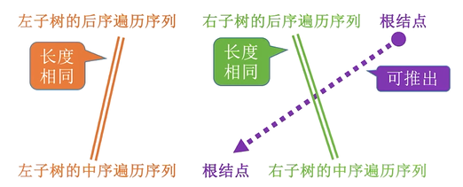
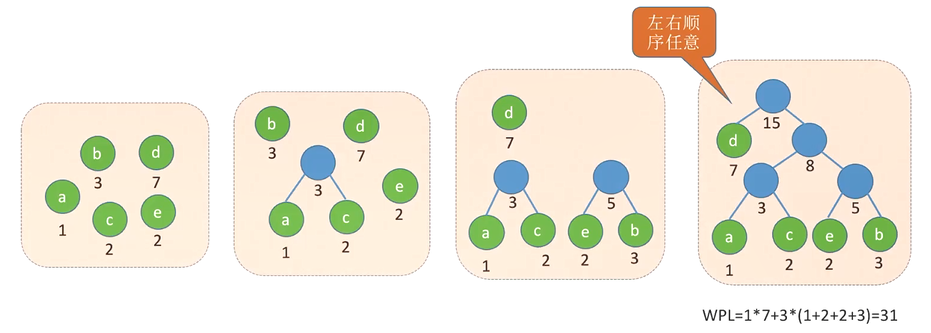

[TOC]

# 一、数据结构和算法

# 二、线性表

## 1 线性表的定义和基本操作

### 1.1 线性表的定义

线性表是具有相同数据类型的n（n≥0）个数据元素的有限序列，其中n为表长，当n=0时线性表是一个空表。

若用L命名线性表，则其一般表示为 L=（a~1~,a~2~,···,a~i~,a~I+1~,···,a~n~）,式中a~1~是唯一的“第一个”数据元素，又称表头元素；

a~n~是唯一个个"最后一个"数据元素，又称表尾元素。

除第一个元素外，每个数据元素有且仅有一个直接前驱；除最后一个元素外，每个数据元素有且仅有一个直接后继。

### 1.2 线性表的特点

-   表中元素的个数有限。
-   表中元素的都具有逻辑上的顺序性，表中元素有其先后次序。
-   表中元素都是数据元素，每个元素都是单个元素。
-   表中元素的数据类型都相同，这意味着每个元素占有相同大小的存储空间。
-   表中元素具有抽象性，即仅讨论元素间的逻辑关系，而不考虑元素究竟表示什么内容。

### 1.3 线性表的抽象数据类型ADT

```C++
ADT List{
数据对象：D={ai|ai=ElemSet,i=1,2,..,n,n≥0}
数据关系：R={<ai-1,ai>|ai-1,ai∈D,i=2,...,n}
基本操作：
IniList(&L)
	操作结果：构造一个空的线性表L。
DestroyList(&L)
    初始条件：线性表L已存在
	操作结果：销毁线性表L
ClearList(&L)
    初始条件：线性表L已存在
	操作结果：将L重置为空表
ListEmpty(L)
    初始条件：线性表L已存在
	操作结果：若L为空表，则返回true，否则返回false
ListLength(L)
    初始条件：线性表L已存在
	操作结果：返回L中数据元素个数
GetElem(L,i,&e)
	初始条件：线性表L已存在，1≤i≤ListLength(L)   
	操作结果：用e返回L中第i个数据元素的值
LocateElem(L,e,compare())
    初始条件：线性表L已存在
	操作结果：返回L中第一个值与e相同的数据元素在L中的位置。若这样的数据元素不存在，则返回值为0.
PriorElem(L,cur_e,&pre_e)
    初始条件：线性表L已存在
	操作结果：若cur-e是L的数据元素，且不是第一个，则用pre_e返回它的前驱，否则操作失败，pre_e无定义
NextElem(L,cur_e,&next_e)
    初始条件：线性表L已存在
	操作结果：若cur_e是L的数据元素，且不是最后一个，则用next_e返回它的后继，否则操作失败，next_e无定义
ListInsert(&L,i,e)
	初始条件：线性表已存在，1≤i≤ListLength(L)+1
	操作结果：在L中第i个位置之前插入新的数据元素e,L的长度加1
ListDelete(&L,i,&e)
	初始条件： 线性表存在且非空，1≤i≤ListLength(L)
	操作结果：删除L的第i个数据元素，并用e返回其值，L的长度减1
TravarseList(L)
    初始条件：线性表已存在
	操作结果：依次对线性表L进行遍历，在遍历过程中对L的每个结点访问一次
}ADT List
```

### 1.4 线性表基本操作

```C++
InitList(&L)：初始化表。构造一个空表L，分配内存空间。
DestroyList(&L)：销毁操作。销毁线性表，并释放线性表L所占用的内存空间。
ListInsert(&L,i,e)：插入操作。在表L中第i个位置上插入指定元素e。
ListDelete(&L,i,&e)：删除操作。删除表L中第i个位置的元素，并用e返回删除元素的值。
LocateElem(L,e)：按值查找操作。在表L中查找具有给定关键字值的元素。
GetElem(L,i)：按位查找操作。获取表L中第i个位置的元素的值。
Length(L)：求表长。返回线性表L的长度，即L中数据元素的个数。
PrintList(L)：输出操作。按前后顺序输出线性表L的所有元素的值。
Empty(L)：判空操作。若L为空表，则返回true，否则返回false。
```

## 2 顺序表

### 2.1 顺序表的定义

**顺序表的存储结构：**顺序存储，即逻辑上相邻的数据元素在物理上也相邻

**顺序表的特点：**

1.  ==随机存取==，即可以在O(1)时间内找到第i个元素
2.  存储密度高，每个节点只存储数据元素
3.  拓展容量不方便（即便采用动态分配的方式实现，拓展长度的时间复杂度也比较高）
4.  插入、删除操作不方便，需要移动大量元素

**优点：**可随机存取，存储密度高

**缺点：**需要大片连续的空间，改变容量不方便

#### 2.1.1 顺序表的实现方式

**顺序表有两种实现方式：**

1.  静态分配
    -   使用"静态数组"实现，大小一旦确定就无法改变
2.  动态分配
    -   使用"动态数组"实现
    -   顺序表满时，可以再用new关键字重新申请更大的内存空间来拓展顺序表的最大长度
    -   需要将数据元素复制到新的存储空间，并用delete关键字释放原来的空间

```C++
//静态分配的顺序表（大小一旦确定就无法改变）
#define MAXSIZE 10//线性表的最大长度
typedef struct{
	ElemType data[MAXSIZE];
    int length;
}SqList;
//动态分配的顺序表（使用动态数组实现）
#define INITSIZE 10//顺序表的初始长度
typedef struct{
    ElemType *data;//指示动态分配数组的指针
    int MaxSize;//顺序表的最大容量
    int length;//顺序表当前的长度
}SeqList;
```

#### 2.1.2 初始化顺序表 InitList

**1) 静态分配顺序表**

```C++
//初始化顺序表（固定长度，不设置默认值）
void InitList(SqList &L){
    L.length = 0;
}
//初始化顺序表（固定长度，设置默认值）
void InitList(SqList &L){
	for(int i = 0; i< L.MaxSize;i++){
        L.data[i] = 0;
    }
    L.length = 0;
}
```

**2) 动态分配顺序表的初始化**

```C++
//初始化顺序表
void InitList(SeqList &L){
    L.data = new ElemType[INITSIZE];//申请初始空间
    if(!L.data)//如果申请失败，结束程序
        eixt(OVERFLOW);
    L.MaxSize = INITSIZE;
    L.length = 0;
}
```

**3) 动态分配长度顺序表增加表长**

```C++
void IncreaseSjze(SeqList &L,int len){
    ElemType *p = L.data;
    L.data = new ElemType[L.MaxSize+len];//重新申请更大的空间
    for(int i = 0; i<L.lenth;i++){
        L.data[i] = p[i];//将数据复制到新的空间
    }
    L.MaxSize += len;//顺序表长度增加 len
    delete(p);//释放原来的内存空间
}
```

### 2.2 顺序表的插入和删除

#### 2.2.1 顺序表的插入 ListInert

```C++
bool ListInsert(SeqList &L,int i,Elemtype e){
    if(i<i||i>L.length+1)//判断i的范围是否有效
        return false;
    if(L.length>=L.MaxSize)//如果内存空间不够，重新申请空间
        IncreaseSize(L,10);
    for(int j=L.length;j>=i;j--)//将第i个及之后的元素依次后移
        L.data[j] = L.data[j-1];
    L.data[i-1] = e;//在第i个位置出插入元素e
    L.length++;//顺序表长度加1
    return true;
}
```

**时间复杂度：**

最好情况：新元素插到表位，不需要移动元素，循环0次，==最好时间复杂度=O(1)==

最坏情况：新元素插到表头，移动n个元素，循环n次，==最坏时间复杂度=O(n)==

平均情况：插入每个位置的概率相等，为p=$\frac{1}{1+n}$，平均循环次数=$\frac{0+1+2+...+n}{1+n}=\frac{n}{2}$，==平均时间复杂度=O(n)==

#### 2.2.2 顺序表的删除操作 ListDelete

```C++
bool ListDelete(SeqList &L,int i,Elemtype &e){
    if(i<1||i>L.length)//判断i的范围是否合格
        return false;
    e = L.data[i-1];//返回位置i元素
    for(int j = i;j<L.length;j++)//第i个及之后的元素以此前移
        L.data[j-1] = L.data[j];
    L.length--;//顺序表长度减1
    return true;
}
```

**时间复杂度：**

最好情况：删除表尾元素，不需要移动其他元素，循环0次，==最好时间复杂度=O(1)==

最坏情况：删除表头元素，移动后续n-1个元素，循环n-1次，==最坏时间复杂度=O(n)==

平均情况：删除每个元素的概率相等，为p=$\frac{1}{n}$，平均循环次数=$\frac{0+1+...+(n-1)}{n}=\frac{n-1}{2}$，==平均时间复杂度=O(n)==

### 2.3 顺序表的查找

#### 2.3.1 按位查找(GetElem)

```C++
//获取表L中第i个位置的元素的值
//通过数组下标直接获取
ElemType getElem(SeqList L,int i){
    
    return L.data[i-1];
}
```

**时间复杂度=**O(1)

#### 2.3.2 按值查找(LocateElem)

```C++
//在顺序表L中查找第一个元素值等于e的元素，并返回其位序
//从第一个元素一次往后检索（从头遍历）
int LocateElem(SeqList L,ElemType e){
    for(int i = 0;i<L.length;i++)
        if(L.data[i]==e)
            return i+1;//数组下标为i的元素值等于e，返回其位序i+1
    return 0;//退出循环，说明查找失败
}
```

**时间复杂度：**

最好情况：目标元素在表头，循环1次，==最好时间复杂度=O(1)==

最坏情况：目标元素在表尾，循环n次，==最坏时间复杂度=O(n)==

平均情况：目标元素出现的概率相同，为p=$\frac{1}{n}$，平均循环次数=$\frac{1+2+...+n}{n}=\frac{1+n}{2}$，==平均时间复杂度=O(n)==

### 2.4 顺序表基本操作全部实现

```C++
#define OK 1
#define ERROR 0
#define OVERFLOW -2
#define INITSIZE 10
typedef int Status;
typedef int ElemType;
//结构体
typedef struct {
    ElemType *data;
    int MaxSize;
    int length;
} SeqList;
//初始化顺序表
Status InitList(SeqList &L) {
    L.data = new ElemType[INITSIZE];
    if (!L.data)
        exit(OVERFLOW);
    L.MaxSize = INITSIZE;
    L.length = 0;
    return OK;
}
//销毁顺序表
Status DestroyList(SeqList &L) {
    delete (L.data);
    L.MaxSize = 0;
    L.length = 0;
    return OK;
}
//增加表长
Status IncreaseList(SeqList &L, int len) {
    int *p = L.data;
    L.data = new ElemType[L.MaxSize + len];
    if (!L.data)
        exit(OVERFLOW);
    for (int i = 0; i < L.length; i++)
        L.data[i] = p[i];
    L.MaxSize += len;
    return OK;
}
//判空
bool ListEmpty(SeqList L) {
    if (L.length == 0)
        return true;
    else
        return false;
}
//清空顺序表
Status ClearList(SeqList &L) {
    L.length = 0;
    return OK;
}
//按位插入
Status ListInsert(SeqList &L, int i, ElemType e) {
    if (i < 1 || i > L.length + 1)
        return ERROR;
    if (L.length == L.MaxSize)
        return ERROR;
    for (int j = L.length; j >= i; j--)
        L.data[j] = L.data[j - 1];
    L.data[i - 1] = e;
    L.length++;
    return OK;
}
//按位删除
Status ListDelete(SeqList &L, int i, ElemType &e) {
    if (i < 1 || i > L.length)
        return 0;
    e = L.data[i - 1];
    for (int j = i; j < L.length; j++)
        L.data[j - 1] = L.data[j];
    L.length--;
    return OK;
}
//按位查找
ElemType GetElem(SeqList L, int i) {
    if (i < 1 || i > L.length)
        exit(OVERFLOW);
    return L.data[i - 1];
}
//按值查找，返回其位序
int LocateElem(SeqList L, ElemType e) {
    for (int i = 0; i < L.length; i++)
        if (L.data[i] == e)
            return i;
    return 0;
}
```

##  2 单链表

### 2.1 单链表的定义

**单链表：**线性表的链式存储，它是指通过一组任意的存储单元来存储线性表中的数据元素。

**优点：**不要求大片连续空间，改变容量方便

**缺点：**不可随机存取，要耗费一定空间存放指针

**结点：**

```C++
typedef struct LNode {
    ElemType data;//数据域,存放数据元素
    struct LNode *next;//指针域，指向下一个结点
} LNode, *LinkList;//LNode表示结点，LinkList表示链表
```


**定义辨析：**

1.  头指针：指向链表中第一个结点的指针
2.  头结点：在首元结点之前的一个结点，不存放数据，其指针域指向首元结点
3.  首元结点：链表中存储第一个数据元素的结点


#### 2.1.1 不带头结点的单链表

**初始化单链表：**

```C++
//初始化单链表
bool InitList(LinkList &L) {
    L = nullptr;//表空，暂时没有任何结点，防止头指针的地址原来有脏数据
    return true;
}
```

**判断表空：**

```C++
//判断单链表是否为空
bool Empty(LinkList L) {
    if (!L)
        return true;
    else
        return false;
}
```

#### 2.1.2 带头结点的单链表

```C++
//初始化单链表
bool InitList(LinkList &L) {
    L = new LNode;//申请头结点
    if (!L)//空间申请失败
        return false;
    L->next = nullptr;
    return true;
}
```

**判断表空：**

```C++
//判断单链表是否为空
bool Empty(LinkList L) {
    return (L->next == nullptr);
}
```

### 2.2单链表的插入

#### 2.2.1 单链表的按位插入

**带头结点：**

```C++
//按位序插入
bool ListInsert(LinkList &L, int i, ElemType e) {
    if (i < 1)
        return false;
    LNode *p = L;//指向头结点，头结点是第0个结点
    int j = 0;//计数器,p指向的第几个结点
    while (p && j < i - 1) {//循环找到第i-1个结点或到表尾
        p = p->next;
        ++j;
    }
    if (!p)//p指针为空，也就是i值不合法，i>单链表长度
        return false;
    LNode *s = new LNode;
    s->data = e;
    s->next = p->next;
    p->next = s;//s插到p之后
    return true;
}
```

**时间复杂度：**O(n)

**不带头结点：**

```C++
//按位插入
bool ListInsert(LinkList &L, int i, ElemType e) {
    if (i < 1)
        return false;
    if (i == 1) {//插入第1个结点
        LNode *s = new LNode;
        s->data = e;
        s->next = nullptr;
        L = s;
        return true;
    }
    //插入第2个及之后的结点
    int j = 1;
    LNode *p = L;
    while (p && j < i - 1) {//i>n
        p = p->next;
        ++j;
    }
    if (!p)
        return false;
    LNode *s = new LNode;
    s->data = e;
    s->next = p->next;
    p->next = s;
    return true;
}
```

#### 2.2.2 指定结点后插入结点

**方法：**

1.  判断给定结点p不为空
2.  创建新结点s，并将给定值e赋给结点s
3.  s结点插入到结点p之后

```C++
//指定结点后插入结点
bool InsertNextNode(LNode *p, ElemType e) {
    if (p == nullptr)
        return false;
    LNode *s = new LNode;
    if (!s)
        return false;
    s->data = e;
    s->next = p->next;
    p->next = s;
    return true;
}
```

**时间复杂度：**O(1)

#### 2.2.3 指定结点前插入结点

**方法：**

1.  判断给定结点p不为空
2.  创建新结点s，并将结点p的数据元素复制到结点s
3.  将结点s插入到结点p之后
4.  将要插入的元素e赋给结点p

```C++
//指定结点前插入结点
bool InsertPriorNode(LNode *p, ElemType e) {
    if (p == nullptr)
        return false;
    LNode *s = new LNode;
    if (!s)
        return false;
    s->data = p->data;
    s->next = p->next;
    p->data = e;
    p->next = s;
    return true;
}
```

**时间复杂度：**O(1)

### 2.3 单链表的删除

#### 2.3.1 按位序删除

**带头结点：**

**方法：**

1.  扫描到第i-1个结点
2.  保存第i个结点
3.  删除第i个结点
4.  释放第i个结点内存空间

```C++
//按位序删除
bool ListDelete(LinkList &L, int i, ElemType &e) {
    if (i < 1)
        return false;
    LNode *p = L;//p指向头结点，也就是第0个结点
    int j = 0;//计数器，p指向第几个结点
    while (p && j < i - 1) {//扫描到第i-1个结点，或者扫描到表尾
        p = p->next;
        ++j;
    }
    if (!p)//i值不合格,i>表长，扫描全表不存在p
        return false;
    LNode *q = p->next;//保存要删除的结点
    e = q->data;//e存放要删除结点的元素值
    p->next = q->next;//删除结点
    delete (q);//释放删除结点的内存空间
    return true;
}
```

**时间复杂度：**

最好时间复杂度 = O(1)
最坏、平均时间复杂度 = O(n)

按位序删除操作，**带头结点和不带头结点的区别**就在于带头结点==j=0==，不带头结点时==j=1==。

#### 2.3.2 指定结点的删除

```C++
//指定结点的删除(给定结点不为表尾结点的情况)
bool DeleteNode(LNode *p) {
    if (!p)
        return false;
    LNode *q = p->next;
    p->data = q->data;
    p->next = q->next;
    delete (q);
}
```

### 2.4 单链表的查找

#### 2.4.1 按位查找

```C++
//按位查找，返回第i个结点
LNode *GetElem(LinkList L, int i) {
    if (i < 0)
        return nullptr;
    LNode *p = L;
    int j = 0;
    while (p && j < i) {
        p = p->next;
        ++j;
    }
    return p;
}
```

按位查找操作，**带头结点和不带头结点的区别**就在于带头结点==j=0==，不带头结点时==j=1==。

#### 2.4.2 按值查找

**带头结点：**

```C++
//按值查找，在表中查找具有给定关键字值的元素
LNode *LocateElem(LinkList L, ElemType e) {
    LNode *p = L->next;//从首元结点开始查找
    while (p && p->data != e) {
        p = p->next;
    }
    return p;//如果找到了就返回结点指针，没找到就返回空指针
}
```

**时间复杂度=O(n)**

**不带头结点：**

```C++
//按值查找，在表中查找具有给定关键字值的元素
LNode *LocateElem(LinkList L, ElemType e) {
    LNode *p = L;
    while (p && p->data != e) {
        p = p->next;
    }
    return p;
}
```

### 2.5 求表长

```C++
//求表长
int Length(LinkList L) {
    int len = 0;
    LNode *p = L;
    while (p->next) {
        p = p->next;
        len++;
    }
    return len;
}
```

**时间复杂度=O(n)**

求表长操作，**带头结点和不带头结点的区别**就在于带头结点==j=0==，不带头结点时==j=1==。

### 2.6 单链表的建立

#### 2.6.1 尾插法

**步骤：**

1.  初始化单链表
2.  保存表尾结点
3.  while 循环插入结点

##### 1) 带头结点

```C++
//尾插法建立单链表
LinkList list_tail_insert(LinkList &L) {
    ElemType x;
    L = new LNode;
    LNode *s, *r = L;//r为表尾结点
    cin >> x;//输入第一个结点的值
    while (x != 9999) {
        s = new LNode;
        s->data = x;
        r->next = s;
        r = s;//r移到新的表尾结点
        cin >> x;
    }
    r->next = nullptr;//表尾指针置空
    return L;
}
```

##### 2) 不带头结点

```C++
LinkList list_tail_insert(LinkList &L) {
    ElemType x;
    cin >> x;
    L = new LNode;
    L->data = x;
    LNode *r, *s;
    r = L;//尾指针
    cin >> x;
    while (x != 9999) {
        s = new LNode;
        s->data = x;
        r->next = s;
        r = s;//指向表尾结点
        cin >> x;
    }
    r->next = nullptr;
    return L;
}
```

不带头结点的是我自己写的，带头结点和不到头结点的区别是：不带头结点需要先插入首元结点，在进行循环插入；而带头结点可以直接进行循环插入。

#### 2.6.2 头插法

##### 1) 带头结点：

```C++
//头插法
LinkList list_head_insert(LinkList &L) {
    ElemType x;
    L = new LNode;//建立头结点
    LNode *s;
    L->next = nullptr;//表尾指针置空
    cin >> x;
    while (x != 9999) {
        s = new LNode;
        s->data = x;
        s->next = L->next;//s插入到表头
        L->next = s;//头结点指向首元结点
        cin >> x;
    }
    return L;
}
```

**重要应用：链表的逆置**

##### 2) 不带头结点：

```C++
//头插法
LinkList list_head_insert(LinkList &L) {
    ElemType x;
    LNode *s;
    L = nullptr;
    cin >> x;
    while (x != 9999) {
        s = new LNode;
        s->data = x;
        s->next = L;
        L = s;
        cin >> x;
    }
    return L;
}
```

### 2.7 单链表的逆置（头插法思想）

#### 1) 带头结点

```C++
//逆置
void reverse(LinkList &L) {
    LNode *p, *q;
    p = L->next;
    L->next = nullptr;
    while (p) {
        q = p;
        p = p->next;
        q->next = L->next;
        L->next = q;
    }
}
```

#### 2) 不带头结点

```C++
//逆置
void reverse(LinkList &L) {
    LNode *p, *q;
    p = L;
    L = nullptr;
    while (p) {
        q = p;
        p = p->next;
        q->next = L;
        L = q;
    }
}
```

### 2.8 全部操作的实现

#### 1) 带头结点

```C++
typedef int ElemType;
//定义结点
typedef struct LNode {
    ElemType data;//数据域,存放数据元素
    struct LNode *next;//指针域，指向下一个结点
} LNode, *LinkList;//LNode表示结点，LinkList表示链表
//初始化单链表
bool InitList(LinkList &L) {
    L = new LNode;//申请头结点
    if (!L)//空间申请失败
        return false;
    L->next = nullptr;
    return true;
}
//判断表空
bool Empty(LinkList L) {
    return (L->next == nullptr);
}
//按位序插入
bool ListInsert(LinkList &L, int i, ElemType e) {
    if (i < 1)
        return false;
    LNode *p = L;//指向头结点，头结点是第0个结点
    int j = 0;//计数器,p指向的第几个结点
    while (p && j < i - 1) {//循环找到第i-1个结点或到表尾
        p = p->next;
        ++j;
    }
    if (!p)//p指针为空，也就是i值不合法，i>单链表长度
        return false;
    LNode *s = new LNode;
    s->data = e;
    s->next = p->next;
    p->next = s;//s插到p之后
    return true;
}
//指定结点后插入结点
bool InsertNextNode(LNode *p, ElemType e) {
    if (p == nullptr)
        return false;
    LNode *s = new LNode;
    if (!s)
        return false;
    s->data = e;
    s->next = p->next;
    p->next = s;
    return true;
}
//指定结点前插入结点
bool InsertPriorNode(LNode *p, ElemType e) {
    if (p == nullptr)
        return false;
    LNode *s = new LNode;
    if (!s)
        return false;
    s->data = p->data;
    s->next = p->next;
    p->data = e;
    p->next = s;
    return true;
}
//按位序删除
bool ListDelete(LinkList &L, int i, ElemType &e) {
    if (i < 1)
        return false;
    LNode *p = L;//p指向头结点，也就是第0个结点
    int j = 0;//计数器，p指向第几个结点
    while (p && j < i - 1) {//扫描到第i-1个结点，或者扫描到表尾
        p = p->next;
        ++j;
    }
    if (!p)//i值不合格,i>表长，扫描全表不存在p
        return false;
    LNode *q = p->next;//保存要删除的结点
    e = q->data;//e存放要删除结点的元素值
    p->next = q->next;//删除结点
    delete q;//释放删除结点的内存空间
    return true;
}
//指定节点的删除(给定结点不为最后结点的情况)
bool DeleteNode(LNode *p) {
    if (!p)
        return false;
    LNode *q = p->next;
    p->data = q->data;
    p->next = q->next;
    delete q;
    return true;
}
//按位查找，获取表中第i个位置的元素的值
bool GetElem(LinkList L, int i, ElemType &e) {
    if (i < 1)
        return false;
    LNode *p = L;
    int j = 0;
    while (p && j < i) {
        p = p->next;
        ++j;
    }
    if (!p)
        return false;
    e = p->data;
    return true;
}
//按位查找，返回第i个结点
LNode *GetElem(LinkList L, int i) {
    if (i < 0)
        return nullptr;
    LNode *p = L;
    int j = 0;
    while (p && j < i) {
        p = p->next;
        ++j;
    }
    return p;
}
//按值查找，在表中查找具有给定关键字值的元素
LNode *LocateElem(LinkList L, ElemType e) {
    LNode *p = L->next;//从首元结点开始查找
    while (p && p->data != e) {
        p = p->next;
    }
    return p;//如果找到了就返回结点指针，没找到就返回空指针
}
//求表长
int Length(LinkList L) {
    int len = 0;
    LNode *p = L;
    while (p->next) {
        p = p->next;
        len++;
    }
    return len;
}
//尾插法建立单链表
LinkList list_tail_insert(LinkList &L) {
    ElemType x;
    L = new LNode;
    LNode *s, *r = L;//r为表尾结点
    cin >> x;//输入第一个结点的值
    while (x != 9999) {
        s = new LNode;
        s->data = x;
        r->next = s;
        r = s;//r移到新的表尾结点
        cin >> x;
    }
    delete s;
    r->next = nullptr;//表尾指针置空
    return L;
}
//头插法
LinkList list_head_insert(LinkList &L) {
    ElemType x;
    L = new LNode;//建立头结点
    LNode *s;
    L->next = nullptr;//表尾指针置空
    cin >> x;
    while (x != 9999) {
        s = new LNode;
        s->data = x;
        s->next = L->next;//s插入到表头
        L->next = s;//头结点指向首元结点
        cin >> x;
    }
    return L;
}
//逆置
void reverse(LinkList &L) {
    LNode *p, *q;
    p = L->next;
    L->next = nullptr;
    while (p) {
        q = p;
        p = p->next;
        q->next = L->next;
        L->next = q;

    }
}
```

#### 2) 不带头结点

```C++
typedef int ElemType;
//定义结点
typedef struct LNode {
    ElemType data;//数据域,存放数据元素
    struct LNode *next;//指针域，指向下一个结点
} LNode, *LinkList;//LNode表示结点，LinkList表示链表
//初始化链表
bool InitList(LinkList &L) {
    L = nullptr;//表空，暂时没有任何结点，防止头指针的地址原来有脏数据
    return true;
}
//判断表空（无头结点）
bool Empty(LinkList L) {
    if (!L)
        return true;
    else
        return false;
}
//按位插入
bool ListInsert(LinkList &L, int i, ElemType e) {
    if (i < 1)
        return false;
    if (i == 1) {//插入第1个结点
        LNode *s = new LNode;
        s->data = e;
        s->next = nullptr;
        L = s;
        return true;
    }
    //插入第2个及之后的结点
    int j = 1;
    LNode *p = L;
    while (p && j < i - 1) {//i>n
        p = p->next;
        ++j;
    }
    if (!p)
        return false;
    LNode *s = new LNode;
    s->data = e;
    s->next = p->next;
    p->next = s;
    return true;
}
//指定结点后插入结点
bool InsertNextNode(LNode *p, ElemType e) {
    if (!p)
        return false;
    LNode *s = new LNode;
    if (!s)
        return false;
    s->data = e;
    s->next = p->next;
    p->next = s;
    return true;
}
//指定结点前插入结点
bool InsertPriorNode(LNode *p, ElemType e) {
    if (!p)
        return false;
    LNode *s = new LNode;
    if (!s)
        return false;
    s->data = p->data;
    s->next = p->next;
    p->data = e;
    p->next = s;
    return true;

}
//按位序删除
bool ListDelete(LinkList &L, int i, ElemType &e) {
    if (i < 1)
        return false;
    LNode *p = L;//首元结点
    int j = 1;
    while (p && j < i - 1) {
        p = p->next;
        j++;
    }
    if (!p)
        return false;
    LNode *q = p->next;
    e = q->data;
    p->next = q->next;
    delete q;
    return true;
}
//指定节点的删除(给定结点不为最后结点的情况)
bool DeleteNode(LNode *p) {
    if (!p)
        return false;
    LNode *q = p->next;
    p->data = q->data;
    p->next = q->next;
    delete q;
    return true;

}
//按位查找，获取表中第i个位置的元素的值
bool GetElem(LinkList L, int i, ElemType &e) {
    if (i < 1)
        return false;
    int j = 1;
    LNode *p = L;
    while (p && j < i) {
        p = p->next;
        j++;
    }
    if (!p)
        return false;
    e = p->data;
    return true;
}
//按位查找，返回第i个结点
LNode *GetElem(LinkList L, int i) {
    if (i < 0)
        return nullptr;
    LNode *p = L;
    int j = 1;
    while (p && j < i) {
        p = p->next;
        j++;
    }
    return p;
}
//按值查找，在表中查找具有给定关键字值的元素
LNode *LocateElem(LinkList L, ElemType e) {
    LNode *p = L;
    while (p && p->data != e) {
        p = p->next;
    }
    return p;
}
//求表长
int Length(LinkList L) {
    LNode *p = L;
    int len = 1;
    while (!p->next) {
        p = p->next;
        len++;
    }
    return len;
}
//尾插法建立单链表
LinkList list_tail_insert(LinkList &L) {
    ElemType x;
    cin >> x;
    L = new LNode;
    L->data = x;
    LNode *r, *s;
    r = L;//尾指针
    cin >> x;
    while (x != 9999) {
        s = new LNode;
        s->data = x;
        r->next = s;
        r = s;//指向表尾结点
        cin >> x;
    }
    delete s;
    r->next = nullptr;
    return L;
}
//头插法
LinkList list_head_insert(LinkList &L) {
    ElemType x;
    LNode *s;
    L = nullptr;
    cin >> x;
    while (x != 9999) {
        s = new LNode;
        s->data = x;
        s->next = L;
        L = s;
        cin >> x;
    }
    return L;
}
//逆置
void reverse(LinkList &L) {
    LNode *p, *q;
    p = L;
    L = nullptr;
    while (p) {
        q = p;
        p = p->next;
        q->next = L;
        L = q;
    }
}
```

## 3 双向链表

### 3.1 结点


```C++
typedef struct DNode {
    ElemType data;
    struct DNode *prior;//前指针
    struct DNode *next;//后指针
} DNode, *DLinkList;
```

### 3.2 初始化

```C++
bool initList(DLinkList &L) {
    L = new DNode;//头结点
    if (!L)
        return false;
    L->prior = nullptr;//头结点prior指向空
    L->next = nullptr;
    return true;
}
```

### 3.3 判空

```C++
bool empty(DLinkList L) {
    if (!L->next)
        return false;
    else
        return true;
}
```

### 3.4 插入结点

```C++
//在p结点后插入s结点
bool insert_next_node(DNode *p, DNode *s) {
    if (!p || !s)
        return false;
    s->next = p->next;
    if (p->next)//如果p结点有后继节点
        p->next->prior = s;
    s->prior = p;
    p->next = s;
    return true;
}
```

### 3.5 删除结点

```C++
//删除结点p的后继节点
bool delete_next_node(DNode *p) {
    if (!p || !p->next)
        return false;
    DNode *q = p->next;
    p->next = q->next;
    if (q->next)
        q->next->prior = p;
    delete q;
    return true;
}
```

### 3.6 按位查找

```C++
//按位查找，返回第i个结点
DNode *get_elem(DLinkList &L, int i) {
    if (!L)
        return nullptr;
    int j = 1;
    DNode *p = L->next;
    while (p && j < i) {
        p = p->next;
        j++;
    }
    return p;
}
```

### 3.7 后插法

```C++
bool insert_tail_list(DLinkList &L) {
    if (!L)
        return false;
    L = new  DNode;
    L->prior= nullptr;
    ElemType x;
    DNode *p, *s;
    p = L;
    if (!p)
        return false;
    cin >> x;
    while (x != 9999) {
        s = new DNode;
        s->data = x;
        s->prior = p;
        p->next = s;
        p = s;
        cin >> x;
    }
    p->next = nullptr;
    return true;
}
```

### 3.8 遍历

#### 1） 后向遍历

```C++
//后向遍历打印双链表
void next_to_string(DLinkList L) {
    if (!L)
        exit(-1);
    cout << "打印双链表：";
    DNode *p = L->next;//首元结点
    while (p) {
        cout << p->data << " ";
        p = p->next;
    }
    cout << endl;
}
```

#### 2） 前向遍历

```C++
//前向遍历打印链表
void prior_to_string(DNode *p){//p为表中最后一个结点
    cout << "前项遍历链表：";
    while(p->prior){//p->prior为空表示当前p已经指向头指针
        cout << p->data << " ";
        p=p->prior;
    }
    cout << endl;
}
```

时间复杂度=O(n)

## 4  循环链表

### 4.1 循环单链表

**特点：**

1.  表尾指针的next指向头结点
2.  从一个节点出发，可以找到其他任何一个结点。

#### 1）初始化

```
bool init_list(LinkList &L) {
    L = new LNode;
    if (!L)
        return false;
    L->next = L;
    return true;
}
```

#### 2）判空

```C++
bool empty(LinkList L) {
    if (L->next == L)
        return true;
    else
        return false;
}
```

#### 3）判断结点是否是表尾结点

```C++
bool is_tail(LinkList L, LNode *p) {
    if (p->next == L)
        return true;
    else
        return false;
}
```

### 4.2 循环双链表

**特点：**

1.  表头指针prior指向表尾结点
2.  表尾指针的next指向头结点

#### 1）初始化

```C++
bool init_list(DLinkList &L) {
    L = new DNode;
    if (!L)
        return false;
    L->prior = L;
    L->next = L;
    return true;
}
```

#### 2）判空

```C+=
bool empty(DLinkList L) {
    if (L->next == L)
        return true;
    else
        return false;
}
```

#### 3）判断结点是否为表尾结点

```C++
bool is_tail(DLinkList L, DNode *p) {
    if (p->next == L)
        return true;
    else
        return false;
}
```

#### 4）插入

```C++
//结点p后插入元素值为e的结点
bool insert_next_node(DNode *p, ElemType e) {
    if (!p)
        return false;
    DNode *s = new DNode;
    s->data = e;
    s->next = p->next;
    if (p->next)
        p->next->prior = s;
    s->prior = p;
    p->next = s;
    return true;
}
```

#### 5）删除

```C++
//删除结点p后的结点
bool delete_next_node(DNode *p) {
    if (!p || !p->next)
        return false;
    DNode *q = p->next;
    p->next = q->next;
    if (q->next)
        q->next->prior = p;
    delete q;
    return true;
}
```

#### 6）获取结点

```C++
//获取第i个结点
DNode *get_elem(DLinkList L, int i) {
    if (i < 1 || !L)
        return nullptr;
    DNode *p = L->next;
    int j = 1;
    while (p != L && j < i) {
        p = p->next;
        j++;
    }
    if (p == L)
        return nullptr;
    return p;
}
```

## 5 静态链表（不一定考）

**特点：**分配一整片连续的内存空间，各个结点集中安置

**优点：**增删操作不需要大量移动元素

**缺点：**不能随机存取，只能从头结点开始依次往后查找；==容量固定不可变==

**使用场景：**1）不支持指针的低级语言；2）数据元素数量固定不变的场景(如操作系统的文件分配表FAT)

  

**结点：**

```C++
struct Node{
    ElemType data;
    int next;//游标，充当指针，指向下一个元素的数组下标
};
struct Node node[MAX_SIZE];//初始化
//或者
typedef struct{
    ElemType data;
    int next;
}SLinkList[MAX_SIZE];
SLinkList sLinkList;//初始化
```


### 1）查找

从头结点出发挨个往后遍历

时间复杂度=O(n)

### 2）插入位序为i的结点

1.  找到一个空的结点，存入数据
2.  从头结点出发找到位序为i-1的结点
3.  修改新结点的next
4.  修改i-1号结点的next

### 3）删除某个结点

1.  从头结点出发找到前驱结点
2.  修改前驱节点的游标
3.  被删除结点next设置为-2(设置为-2只是为了表示next为空)

## 6 顺序表和链表的对比

### 1）逻辑结构

都属于线性表，都是线性结构

### 2）存储结构

**顺序表：**采用==顺序存储==，逻辑上相邻的元素，对应的物理存储位置也相邻

1.  优点：支持随机存取，存储密度高
2.  缺点：大片连续空间分配不方便，改变容量不方便，会出现空间闲置或溢出的现象

**链表：**采用==链式存储==，逻辑上相邻的元素，物理存储位置不一定相邻

1.  优点：理想的小空间分配方便，改变容量方便，不会出现空间闲置或溢出现象
2.  缺点：不可随机存取，存储密度低

### 3）基本操作

**创建操作：**

-   顺序表
    -   静态分配，需要与分配一大块连续的内存空间，会造成浪费或溢出，容量不可改变。
    -   也可采用动态分配，容量可以改变，但是需要移动大量的元素，时间代价高
-   链表：动态分配，只需要先申请一个头结点，容量可改变

**销毁操作：**

-   顺序表：系统自动回收内存空间
-   链表：需要手动申请和释放内存

**插入、删除操作：**

-   顺序表：
    -   插入/删除元素需要将后续元素都后移/前移
    -   时间复杂度O(n)，时间开销主要来自移动元素
-   链表：
    -   插入/删除元素只需要修改指针即可
    -   时间复杂度O(n)，时间开销主要来自查找目标元素

**查找操作：**

-   顺序表：
    -   按位查找：O(1)
    -   按值查找：O(n)，若表内有序可采用折半查找，时间复杂度O(log~2~n)
-   链表：
    -   按位查找：O(n)
    -   按值查找：O(n)

### 4）顺序表和链表的选择

|                | 顺序表 | 链表 |
| :------------: | :----: | :--: |
| 弹性（可扩容） |   ×    |  √   |
|     增、删     |   ×    |  √   |
|       查       |   √    |  ×   |

## 7 线性表的应用

### 7.1 线性表的合并

**步骤：**

1.  分别获取LA表长m、LB表长n
2.  遍历LB表，如果表中元素不在A中，插入到LA表后

```C++
//顺序表为例
void merge_list(SeqList &s1,SeqList &s2){
    int m=Length(s1);
    int n=Length(s2);
    for (int i = 0; i < n; i++) {
        ElemType x = s2.GetElem(s2,i+1);
        if(!LocateElem(s1,x))
            ListInsert(s1,++m,x);
    }
}
```

**时间复杂度=O(m*n)**，顺序表和链表都是。

### 7.2 有序表的合并

#### 1）有序顺序表的合并

```C++
void merge_list_seq(SeqList LA, SeqList LB, SeqList &LC) {
    if ((LA.length + LB.length) > LC.MaxSize)
        LC.IncreaseList(LA.length + LB.length - LC.length);//扩展LC的容量
    int a = 0, b = 0, c = 0;
    while (a < LA.length && b < LB.length) {//遍历LA和LB
        if (LA.data[a] <= LB.data[b])//两两相比，把小的那个元素插入到LC表
            LC.data[c++] = LA.data[a++];
        else
            LC.data[c++] = LB.data[b++];
    }
    while (a < LA.length)//如果LA表还有剩余元素，插入到LC表中
        LC.data[c++] = LA.data[a++];
    while (b < LB.length)//如果LB表还有剩余元素，插入到LC表中
        LC.data[c++] = LB.data[b++];
    LC.length = c;
}
```

# 三、栈、队列、数组

## 1 栈

### 1.1 栈的定义和特点

#### 1.1 .1栈的基本概念

**定义：**栈是==只允许在一端进行插入或删除操作==的线性表

**术语：**

1.  栈顶：表尾，允许插入和删除的一端
2.  栈底：表头，不允许插入和删除的一端
3.  空栈：不含元素的空表。

**特点：**后进先出（Last In First Out，LIFO）

#### 1.1.2 栈的抽象数据类型定义

```C++
ADT Stack {
    数据对象：D = {ai|ai∈ElemSet，i=1,2,3,...,n,n≥0}// ElemSet 表示元素的集合
    数据关系：R1={<ai-1,ai>|ai-1,ai∈D，i=2,...,n}// ai-1为前驱，ai为后继
            约定 an 端为栈顶，a1 端为栈底
	基本操作：
        InitStack（&S）初始化操作
            操作结果：构造一个空栈 S
        DestroyStack（&S）销毁栈操作
            初始条件：栈S已存在
            操作结果：栈S被销毁
        ClearStack（&S）栈指控操作
            初始条件：栈S已存在
            操作结果：将S清为空栈
        StackEmpty（S）判定栈是否为空栈
            初始条件：栈S已存在
            操作结果：若栈S为空栈，则返回true,若栈S为非空，则返回false
        StackLength（S）求栈的长度
            初始条件：栈S已存在
            操作结果：返回栈S的元素个数，即栈的长度
        GetTop（S）取栈顶元素
            初始条件：栈S已存在且非空
            操作结果：返回S的栈顶元素，不修改栈顶指针
        Push（&S，e）入栈操作
            初始条件：栈S已存在
            操作结果：插入元素e为新的栈顶元素
        Pop（&S，&e）出栈操作
            初始条件：栈S存在且非空
            操作结果：删除栈S的栈顶元素，并用e返回其值
        StackTraverse(S)
            初始条件：栈S已存在且非空
            操作结果：从栈底到栈顶依次对S的每个数据元素进行访问
}ADT Stack

```

#### 1.1.3 基本操作

```C++
InitStack(&S)：初始化栈。构造一个空栈S，分配内存空间。
DestroyStack(&L)：销毁栈。销毁并释放栈S所占用的内存空间。
Push(&S,x)：进栈。若栈S未满，则将x加入使之成为新的栈顶。
Pop(&S,&x)：出栈。若栈S非空，则弹出栈顶元素，并用x返回。
GetTop(S,&x)：读栈顶元素。若栈S非空，则用x返回栈顶元素。
StackEmpty(S)：判空操作。若S为空栈，则返回true，否则返回false。
```

#### 1.1.4  卡特兰数

n个不同元素进栈，出栈元素不同排列的个数$\frac{1}{n+1}\C_{2n}^{n}$

### 1.2  栈的顺序存储的实现

#### 1.2.1 顺序栈的定义

顺序栈：利用顺序存储结构实现的栈，用静态数组实现，需要记录栈顶指针

```C++
#define MAX_SIZE 10
typedef int ElemType;
typedef struct{
    ElemType data[MAX_SIZE];
    int top;
}SqStack;
```

#### 1.2.2 顺序栈的基本操作的实现

```C++
#define MAX_SIZE 10
typedef int ElemType;
typedef struct {
    ElemType data[MAX_SIZE];
    int top;
} SqStack;
//初始化栈
void InitStack(SqStack &S) {
    S.top = 0;
}
//判空
bool Empty(SqStack S) {
    if (S.top == 0)
        return true;
    else
        return false;
}
//入栈
bool Push(SqStack &S, ElemType x) {
    if (S.top == MAX_SIZE)//栈满
        return false;
    S.data[S.top++] = x;//新元素入栈
    return true;
}
//出栈
bool Pop(SqStack &S, ElemType &x) {
    if (S.top == 0)//栈空
        return false;
    x = S.data[--S.top];
    return true;
}
//读栈顶
bool GetTop(SqStack S, ElemType &x) {
    if (S.top == 0)
        return false;
    x = S.data[S.top-1];
    return true;
}
```

创、增、删、查 时间复杂度为O(1)

### 1.3 共享栈

#### 1.3.1 共享栈的定义

共享栈：两个栈共享一片内存空间


#### 1.3.2 共享栈的实现

```C++
#define MAX_SIZE 10
typedef int ElemType;
typedef struct {
    ElemType data[MAX_SIZE];
    int top0;
    int top1;
} ShareStack;
//初始化
void InitStacki(ShareStack &S) {
    S.top0 == -1;
    S.top1 == MAX_SIZE;
}
//判空
bool Empty(ShareStack S) {
    if (S.top0 == -1 && S.top1 == MAX_SIZE)
        return true;
    else
        return false;
}
//判断栈满
S.top0+1==S.top1;
```

### 1.3 栈的链式存储的实现

#### 1.3.1 链式栈的实现

```C++
typedef int ElemType;
typedef struct StackNode {
    ElemType data;
    struct StackNode *next;
} StackNode, *LinkStack;
//初始化
void InitStack(LinkStack &S) {
    S = nullptr;
}
//入栈
bool Push(LinkStack &S, ElemType x) {
    StackNode *s = new StackNode;
    s->data = x;
    s->next = S;
    S = s;
}
//出栈
bool Pop(LinkStack &S, ElemType &e) {
    if (!S)
        return false;
    e = S->data;
    StackNode *p = S;
    S = S->next;
    delete p;
    return true;
}
//取栈顶元素
bool GetTop(LinkStack S, ElemType &e) {
    if (!S)
        return false;
    e = S->data;
    return true;
}
```

#### 1.3.2 汉诺塔问题的递归算法

**算法步骤：**

1.  如果n=1，则直接将编号为1的圆盘从A移到C，递归结束
2.  否则：
    -   递归，将A上编号为1至n-1的圆盘移动到B，C做辅助塔
    -   直接将编号为n的圆盘从A移到C
    -   递归，将B上编号为1至n-1的圆盘移动到C，A做辅助塔

```C++
void move(LinkStack &from, LinkStack &to) {
    ElemType data;
    Pop(from, data);
    Push(to, data);
}
void hanoi(int n, LinkStack &A, LinkStack &B, LinkStack &C) {
    if (n == 1)
        move(A, C);
    else {
        hanoi(n - 1, A, C, B);
        move(A, C);
        hanoi(n - 1, B, A, C);
    }
}
```

**时间复杂度=O(2^n^)**

**空间复杂度=O(n)**

## 2 队列

### 2.1 队列的定义和特点

#### 2.1.1 队列的概念

**定义：**队列是只允许在一端进行插入，在另一端进行删除的线性表。

**特点：**先进先出 (First In First Out，FIFO)

**术语：**

-   队头：允许删除的一端，又称队首。
-   队尾：允许插入的一端。
-   空队列：不含任何元素的空表。

#### 2.1.2 队列的抽象数据类型定义

```C++
ADT Queue{
	数据对象：D = {ai|ai∈ElemSet，i=1,2,3,...,n,n≥0}
    数据关系：R1={<ai-1,ai>|ai-1,ai∈D，i=2,...,n}
    		约定 a1 端为队列头，an端为队列尾
	基本操作：
		InitQueue(&Q)
			操作结果：构造一个空队列Q
		DestroyQueue(&Q)
			初始条件：队列Q已存在
			操作结果：队列Q被销毁，不再存在
		ClearQueue(&Q)
			初始条件：队列Q已存在
			操作结果：将Q清为空队列
		QueueEmpty(Q)
			初始条件：队列Q已存在
			操作结果：若Q为空队列，则返回true，否则返回false
		GetHead(Q)
			初始条件：Q为非空队列
			操作结果：返回Q的队头元素
		EnQueue(&Q,e)
			初始条件：队列Q已存在
			操作结果：插入元素e为Q的新的队尾元素
		DeQueue(&Q,&e)
			初始条件：Q为非空队列
			操作结果：删除Q的队头元素，并用e返回其值
		QueueTraverse(&Q)
			初始条件：Q已存在且非空
			操作结果：从队头到队尾，依次对Q的每个数据元素访问
}ADT Queue
```

#### 2.1.3 基本操作

```C++
InitQueue(&Q)：初始化队列，构造一个空队列Q。
DestroyQueue(&Q)：销毁队列。销毁并释放队列Q所占用的内存空间。
EnQueue(&Q,x)：入队，若Q未满，将x加入，使之成为新的队尾。
DeQueue(&Q,&x)：出队，若Q非空，删除队头元素，并用x返回。
GetHead(Q,&x)：度队头元素，若队列Q非空，则将队头元素赋值给x。
QueueEmpty(Q)：判断队空，若队列Q为空返回true，否则返回false。
```

### 2.2 队列的顺序实现

#### 2.2.1 循环队列

```C++
#define MAX_SIZE 10//队列初始容量
typedef int ElemType;
//队列的顺序存储结构
typedef struct {
    ElemType *data;
    int front;//队头指针
    int rear;//队尾指针
} SqQueue;
//初始化
bool InitQueue(SqQueue &Q) {
    Q.data = new ElemType[MAX_SIZE];
    if (!Q.data)
        return false;
    Q.front = Q.rear = 0;
    return true;
}
//判空
bool QueueEmpty(SqQueue Q) {
    if (Q.front == Q.rear)//队空条件
        return true;
    else
        return false;
}
//入队
bool EnQueue(SqQueue &Q, ElemType e) {
    if ((Q.rear + 1) % MAX_SIZE == Q.front)//队满
        return false;
    Q.data[Q.rear] = e;//添加数据
    Q.rear = (Q.rear + 1) % MAX_SIZE;//循环队列，队尾指针+1
    return true;
}
//出队
bool DeQueue(SqQueue &Q, ElemType &e) {
    if (Q.front == Q.rear)//队空
        return false;
    e = Q.data[Q.front];//保存队头元素
    Q.front = (Q.front + 1) % MAX_SIZE;//队头指针加1
    return true;
}
//取队头元素
bool GetHead(SqQueue Q, ElemType &e) {
    if (Q.front == Q.rear)
        return false;
    e = Q.data[Q.front];
    return true;
}
//求循环队列长度
int Length(SqQueue Q) {
    return (Q.rear - Q.front + MAX_SIZE) % MAX_SIZE;
}
```

#### 2.2.2 判断队满\队空的三种方式

**第一种方式：**上述循环队列操作中的方式

-   队满：(Q.rear + 1) % MAX_SIZE == Q.front
-   队空：Q.front == Q.rear


**注意：**这种方式下，数组空间中会有一个位置的浪费。

**第二种方式：**

如果想要不浪费这一个空间，需要在结构体中添加一个size属性，用来记录队列的长度，在进行入队出队操作的时候size++或者size--，判断队满size==MAXSIZE

```C++
//队列的顺序存储结构
typedef struct {
    ElemType *data;
    int front;//队头指针
    int rear;//队尾指针
    int size;
} SqQueue;
//初始化
bool InitQueue(SqQueue &Q) {
    Q.data = new ElemType[MAX_SIZE];
    if (!Q.data)
        return false;
    Q.front = Q.rear = 0;
    Q.size = 0;
    return true;
}
```

-   队满：Q.size == MAX_SIZE
-   队空：Q.size == 0

**第三种方式：**

​		结构体中添加一个tag属性，用来记录最近一次的插入或者删除操作。删除操作完成时设置tag\=0，插入操作完成时设置tag\=1。只有删除操作，才可能导致队空；只有插入操作，才可能导致队满。

```C++
#define MAX_SIZE 10//队列初始容量
typedef int ElemType;
typedef struct {
    ElemType *data;
    int front;//队头指针
    int rear;//队尾指针
    int tag;//入队操作后设为1，出队操作后设为0
} SqQueue;

//初始化
bool InitQueue(SqQueue &Q) {
    Q.data = new ElemType[MAX_SIZE];
    if (!Q.data)
        return false;
    Q.front = Q.rear = 0;
    Q.tag = 0;
    return true;
}
```

-   队空：Q.rear == Q.front && Q.tag == 0
-   队满：Q.rear == Q.front && Q.tag == 1

### 2.3 队列的链式实现

#### 2.3.1 带头结点（方便操作）

```C++
typedef int ElemType;
typedef struct LinkNode {
    ElemType data;
    struct LinkNode *next;
} LinkNode;
typedef struct {
    LinkNode *front;
    LinkNode *rear;
} LinkQueue;
//初始化
void InitQueue(LinkQueue &Q) {
    Q.front = Q.rear = new LinkNode;//头结点
    Q.front->next = nullptr;//头结点的指针域置空
}
//判空
bool Empty(LinkQueue Q) {
    if (Q.front == Q.rear)
        return true;
    else
        return false;
}
//入队
bool EnQueue(LinkQueue &Q, ElemType e) {
    LinkNode *s = new LinkNode;
    s->data = e;
    s->next = nullptr;
    Q.rear->next = s;
    Q.rear = s;
    return true;
}
//出队
bool DeQueue(LinkQueue &Q, ElemType &e) {
    if (Q.rear == Q.front)
        return false;
    LinkNode *p = Q.front->next;
    e = p->data;
    Q.front->next = p->next;
    if (Q.rear == p)
        Q.rear = Q.front;
    delete p;
    return true;
}
//取队头元素
bool GetHead(LinkQueue Q, ElemType &e) {
    if (Q.rear == Q.front)
        return false;
    e = Q.front->next->data;
    return true;
}
//获取队列长度
int Length(LinkQueue Q) {
    if (Q.front == Q.rear)
        return 0;
    int len = 0;
    LinkNode *p = Q.front;
    while (p->next) {
        p = p->next;
        len++;
    }
    return len;
}
//遍历
bool traverse(LinkQueue Q) {
    if (Q.rear == Q.front)
        return false;
    std::cout << "打印链式队列：";
    LinkNode *p = Q.front->next;
    while (p) {
        std::cout << p->data << "\t";
        p = p->next;
    }
    std::cout << std::endl;
    return true;
}
```

#### 2.3.2 不带头结点

```C++
typedef int ElemType;
typedef struct LinkNode {
    ElemType data;
    struct LinkNode *next;
} LinkNode;
typedef struct {
    LinkNode *front;
    LinkNode *rear;
} LinkQueue;
//初始化
void InitQueue(LinkQueue &Q) {
    Q.front = nullptr;
    Q.rear = nullptr;
}
//判空
bool Empty(LinkQueue &Q) {
    if (Q.front == nullptr)
        return true;
    else
        return false;
}
//入队
bool EnQueue(LinkQueue &Q, ElemType e) {
    LinkNode *s = new LinkNode;
    s->data = e;
    s->next = nullptr;
    if (Q.front == nullptr) {//在队列中插入第一个结点
        Q.front = s;
        Q.rear = s;
    } else {
        Q.rear->next = s;//新结点插入到Q.rear之后
        Q.rear = s;//修改Q.rear
    }
    return true;
}
//出队
bool DeQueue(LinkQueue &Q, ElemType &e) {
    if (Q.front == nullptr)
        return false;
    LinkNode *p = Q.front;
    e = p->data;
    Q.front = p->next;
    if (p == Q.rear) {//如果删除的p是最后一个结点
        Q.rear = nullptr;
        Q.front = nullptr;
    }
    delete p;
    return true;
}
//获取队列长度
int Length(LinkQueue Q) {
    if (Q.front == nullptr)
        return 0;
    int len = 0;
    LinkNode *p = Q.front;
    while (p) {
        p = p->next;
        len++;
    }
    return len;
}
//遍历
bool traverse(LinkQueue Q) {
    if (Q.front == nullptr)
        return false;
    LinkNode *p = Q.front;
    while (p) {
        std::cout << p->data << "\t";
        p = p->next;
    }
    std::cout << std::endl;
    return true;
}
```

### 2.4 双端队列

**分类：**

-   双端队列：只允许从==两端插入==、==两端删除==的线性表。
-   输入受限的双端队列：只允许从==一端输入==，==两端删除==的线性表
-   输出受限的双端队列：只允许从==两端插入==，==一端删除==的线性表

**考点：**判断输出序列合法性

**PS：**在栈中合法的输出序列，在双端队列中必定合法

## 3 栈的应用

### 3.1 括号匹配

**实现思路：**依次扫描所有字符，遇到左括号入栈，遇到有括号则弹出栈顶元素检查是否匹配

**匹配失败情况：**

1.  右括号和左括号不匹配
2.  右括号消耗完，左括号还有剩余（左括号单身）
3.  左括号消耗完，还有有括号（右括号单身）


**代码实现：**

```C++
bool bracket(char str[], int length) {
    LinkStack S;
    InitStack(S);
    for (int i = 0; i < length; i++) {
        if (str[i] == '(' || str[i] == '[' || str[i] == '{') {
            Push(S, str[i]);//扫描到左括号，出栈
        } else {
            if (Empty(S))//匹配到右括号，且当前栈空
                return false;//匹配失败
            char topElem;
            Pop(S, topElem);//在栈顶元素出栈
            if (str[i] == ')' && topElem != '(')
                return false;
            if (str[i] == ']' && topElem != '[')
                return false;
            if (str[i] == '}' && topElem != '{')
                return false;
        }
    }
    return Empty(S);
}
```

### 3.2 表达式求值

**三种算术表达式：**

1.  中缀表达式：运算符在两个操作数中间，例：a+b-c*d
2.  后缀表达式（逆波兰表达式）：运算符在两个操作数后面，例：ab+cd*-
3.  前缀表达式（波兰表达式）：运算符在两个操作数前面，例：-+ad*cd

**表达式的三种成分：**操作数、运算符、界限符(括号)

#### 3.2.1 中缀表达式转后缀表达式

##### **1）手算方法：**

1.  确定中缀表达式中各个运算符的运算顺序
2.  选择下一个运算符，按照==\[左操作数 右操作数 运算符\]==的方式组合成一个新的操作数
3.  如果还有运算符没被处理，就继续步骤2

**注：**由于运算顺序不唯一，因此对应的后缀表达式也不唯一

**例：**A+B\*(C-D)-E/F

转后缀表达式：ABCD-\*+EF/-（计算机应该得到的结果）

​						   ABCD-\*EF/-+

**注：**要保证==手算和机算结果相同（为了确保算法的”正确性“）==，应采用“左优先”原则

>   **==”左优先”原则：==**只要左边的运算符能先计算，就优先算左边的

**例：**A+B-C\*D/E+F ==> AB+CD\*F/-F+

##### 2）机算方法：

1.  初始化一个栈，用于保存暂时还不能确定运算顺序的运算符
2.  从左到右处理各个元素，直到末尾。可能遇到三种情况：
    1.  遇到==操作数==。直接加入后缀表达式。
    2.  遇到==界限符==。遇到'('直接入栈；遇到')'则依次弹出栈内运算符并加入后缀表达式，知道弹出'('为止。注意：'('不加入后缀表达式。
    3.  遇到==运算符==。依次弹出栈内==优先级==高于或等于当前运算符的所有运算符，并加入后缀表达式，若碰到'('或栈空则停止。之后再把当前运算符入栈。
3.  按上述方法处理完所有字符后，将栈中剩余运算符依次弹出，并加入后缀表达式

#### 3.2.2 后缀表达式的计算

**后缀表达式的手算方法：**

​	从左往右扫描，每遇到一个运算符，就让==运算符前面最近的两个操作数==执行对应运算，合为一个操作数

**用栈实现后缀表达式的计算：**

1.  ==从左到右==扫描下一个元素，直到处理完所有元素

2.  若扫描到操作数则压入栈，并返回步骤1；否则执行步骤3

3.  若扫描到运算符，则弹出两个栈顶元素，执行相应运算，运算结果压入栈顶，回到步骤1

    >   注意：先出栈的是右操作数

#### 3.2.3 中缀表达式转前缀表达式

**手算方法：**

1.  确定中缀表达式中各个运算符的运算顺序
2.  选择下一个运算符，按照==\[运算符 左操作数 右操作数\]==的方式组合成一个新的操作数
3.  如果还有运算符没被处理，就继续步骤2

**”右优先“原则：**只要右边的运算符能先计算，就优先算右边的

**注：**一个中缀表达式可以对应多个后缀、前缀表达式

#### 3.2.4 前缀表达式的计算

**用栈实现前缀表达式的计算：**

1.  ==从右往左==扫描下一个元素，知道处理完所有元素
2.  若扫描到操作数则压入栈，并回到步骤1；否则执行步骤3
3.  若扫描到运算符，则弹出两个栈顶元素， 执行相应运算，运算结果压入栈顶，回到步骤1

>   注意：先出栈的是左操作数

#### 3.2.5 中缀表达式的计算

**用栈实现中缀表达式的计算：**

1.  初始化两个栈，==操作数栈==和==运算符栈==
2.  若扫描到操作数，压入操作数栈
3.  若扫描到运算符或界限符，则按照“中缀转后缀”相同逻辑压入运算符栈（期间也会弹出运算符，每当弹出一个运算符时，就需要再弹出两个操作数栈的栈顶元素并执行相应的运算，运算结果在压回操作数栈）


### 3.3 递归中的应用

#### 3.2.1 递归

**递归调用**其实就是**特殊的函数调用**，只不过它**调用的函数是其本身**而已。

**函数调用的特点：**最后被调用的函数最先执行结束（LIFO）

函数调用时需要用一个栈存储：

1.  调用返回地址
2.  实参
3.  局部变量

**递归算法的两部分：**

1.  递归表达式（递归体）
2.  边界条件（递归出口）

>   **缺点：**递归层数太多会导致栈溢出。
>
>   **缺点：**可能包含很多重复计算。

#### 3.3.2 阶乘

```C++
int factorial(int n) {
    if (n == 0 || n == 1)
        return 1;
    else
        return n * factorial(n - 1);
}
```

#### 3.3.3 斐波那契数列

```C++
int fib(int n) {
    if (n == 0)
        return 0;
    else if (n == 1)
        return 1;
    else
        return fib(n - 1) + fib(n - 2);
}
```

#### 3.3.4 利用栈将递归转换为非递归的方法

**利用栈消除递归的步骤：**

1.  设置一个工作栈存放递归工作记录（包括实参、返回地址、及局部变量等）
2.  进入非递归调用入口（即被调用程序开始处）将调用程序传来的实在参数和返回地址入栈（递归程序不可以作为主程序，因而可认为初始是被某个调用程序调用）。
3.  进入递归调用入口：当不满足递归结束条件时，逐层递归，将实参、返回地址及局部变量入栈，这一过程可用循环语句来实现——模拟递归分解的过程。
4.  递归结束条件满足，将到达递归出口的给定常数作为当前的函数值。
5.  返回处理：在栈不空的情况下，反复退出栈顶记录，根据记录中的返回地址进行题意规定的操作，即逐层计算当前函数值，直至占空为止——模拟递归求值过程。

#### 3.3.5 用栈实现的非递归阶乘

```C++
int non_recursion_factorial_1(int n) {
    stack<int> stack;//新建一个栈，存储每层递归的计算结果
    int result = 1;
    if (n == 0 || n == 1)//边界条件
        return 1;
    while (n != 1 && n != 0)//while循环，将每层的计算结果入栈
        stack.push(n--);
    while (!stack.empty()) {//栈非空，逐层计算函数值，依次退栈，直到栈空
        result = result * stack.top();
        stack.pop();
    }
    return result;
}
```

## 4 队列的应用

树的遍历、图的广度优先遍历

1.  4.  

# 四、串

## 1 串的定义

### 1.1 串的定义

**定义：**串(string)是由0个或多个字符组成的有限序列。一般记为 $S='a1a2···an'(n≥0)$

​		其中S是串名，单引号中的内容是串的值；a~i~可以是字母、数字或其他字符；串中字符的数目n称为串的长度。n=0时的串称为空串（用 ∅ 表示）。

**子串：**串中任意个连续的字符组成的子序列。（任意的意思是可以为0）

**主串：**包含子串的串相应的称为主串。

**字符在主串中的位置：**字符在串中的序号。

**子串在主串中的位置：**子串的第一个字符在主串中的位置。

**两个串相等：**当且仅当两个串的值相等。

**空格串：**由一个或多个空格组成的串“    ”称为空格串。

>   注意：空格串不是空串。

### 1.2串的特点

​		字符串一般简称为串。串是一种特殊的线性表，数据元素之间呈线性关系，其特殊性体现在数据元素是一个字符，也就是说，串是一种==内容受限的线性表==。

### 1.3 串的抽象数据类型

```C++
ADT String{
    数据对象：D={ai|ai∈CharacterSet,i=1,2,···,n,n≥0}
    数据关系：R1={<ai-1,ai>|ai-1,ai∈D,i=1,2,···,n}
    基本操作：
        StrAssign(%T,chars)//赋值操作
        	初始条件：chars是字符串常量
        	操作结果：生成一个其值等于chars的串T
        StrCopy(&T,S)//复制
        	初始条件：串S存在
        	操作结果：有串S复制得串T
        StrEmpty(S)//判空
        	初始条件：串S存在
        	操作结果：若S为空串，则返回true，否则返回false
        StrCompare(S,T)//比较
        	初始条件：串S和T存在
        	操作结果：若S>T,则返回值>0;若S=T,则返回值=0,若S<T,则返回值<0
        StrLength(S)//求串长
        	初始条件：串S存在
        	操作结果：返回串的元素个数，称为串的长度
        ClearString(&S)//清空串
        	初始条件：串S存在
        	操作结果：将S清为空串
        Concat($T,S1,S2)//串联接
        	初始条件：串S1和串S2存在
        	操作结果：用T返回由S1和S2连接而成的新串
        SubString(&Sub,S,pos,len)//获取子串
        	初始条件：串S存在,1≤pos≤StrLength(S)且0≤len≤StrLength(S)-pos+1
        	操作结果：用Sub返回串S的第pos个字符起长度为len的子串
        Index(S,T)//定位子串
        	初始条件：串S和T存在，T是非空串
        	操作结果：若主串S中存在和串T值相同的子串，则返回它在主串S中第一次出现的位置;否则函数值为0
        Replace(&S,T,V)//替换子串
        	初始条件：串S,T,V存在,T是非空串
        	操作结果：用V替换主串S中出现的所有与T相等的不重叠的字串
        StrInsert(&S,pos,T)//插入子串
        	初始条件：串S和T存在，1≤pos≤StrLength(S)+1
        	操作结果：在串S的第pos个字符之前插入串T
        StrDelete(&S,pos,len)//删除子串
        	初始条件：串S存在，1≤pos≤StrLength(S)-len+1
        	操作结果：从串S中删除第pos个字符起长度为len的子串
        DestroyString(&S)//销毁串
        	初始条件：串S存在
        	操作结果：串S被销毁
}
```

**字符串比较：**

1.  两个串逐字符对比，先出现较大字符那个串就大
2.  长串的前缀与短串相同时，长的那个大

### 1.4 字符集

1.  ASCII字符集——英文字符——八个比特位表示
2.  UniCode字符集——中英文

基于相同的字符集可以有多个不同的编码方式，比如:UTF-8、UTF-16等。

采用不同的编码方式，每个字符所占的空间不同，考研默认每个字符1B即可。

## 2 串的实现

### 2.1 串的顺序存储

**串的定长顺序存储结构：**

```C++
#define MAXLEN 255//串的最大长度
typedef struct{
    char ch[MAXLEN];
    int length;
}SString;
```

**串的堆式顺序存储结构 ：**

```C++
typedef struct{
    char *ch;//动态数组（堆分配存储）
    int length;
}HString;
```

**不同的实现方式：（选择方法4）**


### 2.2 串的链式存储

**结构1：**

```C++
typedef struct StringNode{
	char ch;
    struct StringNode *next;
}StringNode,*String;
```

**缺点：**存储密度低，每个字符1B，每个指针4B

**结构2：（提高存储密度）**

```C++
#define CHUNKSIZE 80//由用户定义的块大小
typedef struct Chunk{
    char ch[CHUNKSIZE];
    struct Chunk *next;
}Chunk;
typedef struct{
    Chunk *head,*tail;//串的头、尾指针
    int length;//串的当前长度
}LString;
```

>   注：如果某个结点的数组存不满，可以用特殊字符填充。

### 2.3 基本操作的实现

#### 2.3.1 求子串 SubString(&Sub,S,pos,len)

```C++
bool SubString(SString &Sub,SString S,int pos,int len){
    if((pos+len-1)>S.length)
        return false;
    for(int i=pos;i<pos+len;i++)
        Sub.ch[i-pos+1]=S.ch[i];
    SUb.length=len;
    return true;
}
```

#### 2.3.2 比较 StrCompare(S,T)

```C++
//比较操作。若S>T,则返回值>0;若S=T,则返回值=0,若S<T,则返回值<0
int StrCompare(SString S,SString T){
    for(int i=1;i<=S.length&&i<T.length;i++){
        if(S.ch[i]!=T.ch[i])
            return S.ch[i]-T.ch[i];
    }
    return S.length-T.length;//扫描过的所有字符都相同，则长度大的串更大
}
```

#### 2.3.3 定位 Index(S,T)

```C++
//定位子串。若主串S中存在和串T值相同的子串，则返回它在主串S中第一次出现的位置;否则函数值为0
int Index(SString S,SString T){
    int i=1;
    SString Sub;
    while(i<S.length-T.length+1){
        SubString(Sub,S,i,T.length);
        if(StrCompare(Sub,T)!=0)
            ++i;
        else
            return i;//返回子串在主串中的位置
    }
    return 0;//没有相同子串
}
```


## 3 串的模式匹配算法

子串的**定位操作**通常称为串的**模式匹配**或**串匹配**。

模式匹配中有两个字符串S和T，S称为**主串**，也称为**正文串**；T为**子串**，也称为**模式**。

### 3.1 BF(Brute-Force)算法

BF算法为暴力算法，又称为朴素模式匹配算法。

**算法步骤：**

1.  分别利用计数指针i和j指示主串S和模式T中当前正待比较的字符位置，i初值为pos，j初值为1.
2.  如果两个串均未比较到串尾，即i和j均分别小于等于S和T的长度时，则循环执行以下操作：
    1.  S.ch[i]和T.ch[j]比较，若相等，则i和j分别指示串中下一个位置，继续比较后续字符。
    2.  若不相等，指针后退重新开始匹配，从主串的下一个字符(i=i-j+2)起再重新和模式的第一个字符(j=1)比较。
3.  如果j>T.length，说明模式T中的每个字符依次和主串S中的一个连续的字符序列相等，则匹配成功，返回模式T中的第一个字符相等的字符在主串S中的序号(i-T.length)；否则称匹配不成功，返回0.

```C++
//指定主串查找的起始位置
int Index_BF(SString S,SString T,int pos){
    int i=pos,j=1;
    while(i<S.length&&j<T.length){
        if(S.ch[i]==T.ch[j]){
            i++;
            j++;
        }
        else{
            i=i-j+2;
            j=1;
        }
    }
    if(j>T.length)
        retuen i-T.length;
    else 
        return 0;
}
```

**从头开始扫描：**

```
int Index_BF(SString S,SString T){
    int i=1,j=1;
    while(i<S.length&&j<T.length){
        if(S.ch[i]==T.ch[j]){
            ++i;
            ++j;
        }
        else{
            i=i-j+2;
            j=1;
        }
    }
    if(j>T.length)
        retuen i-T.length;
    else 
        return 0;
}
```

**时间复杂度：**主串长度为n，模式长度为m，最坏时间复杂度O(nm)

### 3.2 KMP 算法

#### 3.2.1 KMP算法原理

Knuth-Morris-Pratt 字符串查找算法。

**前缀：**除最后一个字符外，字符串的的所有头部子串。（所有头部子串的集合）

**后缀：**除第一个字符外，字符串的所有尾部子串。（所有尾部子串的集合）

**部分匹配值：**字符串的前缀和后缀的最长相等前后缀长度。（前缀和后缀交集中最长的那个的长度）

​		KMP算法需要根据模式串T，计算出next数组，next数组中存放的是每个长度的部分匹配值，KMP算法利用next数对模式串组进行回溯，但是主串不回溯。

KMP算法，**最坏时间复杂度：O(m+n)**，求next数组时间复杂度O(m)，模式匹配最坏时间复杂度O(n)。

**代码实现：**

```C++
int Index_KMP(HString S, HString T) {
    int i = 1, j = 1;
    int next[T.length + 1];
    get_next(T, next);
    while (i <= S.length && j <= T.length) {
        if (j == 0 || S.ch[i] == T.ch[j]) {
            ++i;
            ++j;
        } else {
            j = next[j];
        }
    }
    if (j > T.length)
        return i - T.length;
    else
        return 0;
}
```

#### 3.2.2 next数组

##### 1）手算

先填写：next[1]=0,next[2]=1

后续：在不匹配的位置前上画一条线，模式串一步一步后退，知道分界线之前能“**对上**”，或模式串完全退到分界线后，也就是不匹配的位置。此时j指向哪儿，next数组值就是多少。

##### 2）实现

```C++
void get_next(HString T, int next[]) {
    if (T.length == 0)
        exit(-2);
    int i = 1, j = 0;
    next[1] = 0;
    while (i < T.length) {
        if (j == 0 || T.ch[i] == T.ch[j]) {
            ++i;
            ++j;
            next[i] = j;
        } else {
            j = next[j];
        }
    }
}
```

#### 3.2.3 nextval数组代码实现

```C++
void get_next_val(HString T, int nextval[]) {
    if (T.length < 0)
        return;
    int i = 1, j = 0;
    nextval[1] = 0;
    while (i <= T.length) {
        if (j == 0 || T.ch[i] == T.ch[j]) {
            ++i;
            ++j;
            if (T.ch[i] != T.ch[j])
                nextval[i] = j;
            else
                nextval[i] = nextval[j];
        } else {
            j = nextval[j];
        }
    }
}
```

# 五、数组

## 5.1 数组的定义

**数组：**数组是由类型相同的数据元素组成的有序集合，每个元素称为数组元素。

## 5.2 数组的存储结构

### 5.2.1 一维数组

```C++
ElemType arr[10];
```

内存：各数组元素大小相同，且物理上连续存放。已知起始地址，数组各元素的物理位置可以直接计算出来。

| arr[0] | arr[1] | arr[2] | arr[3] | arr[4] | arr[5] | arr[6] | arr[7] | arr[8] | arr[9] |
| ------ | ------ | ------ | ------ | ------ | ------ | ------ | ------ | ------ | ------ |

起始地址LOC=arr[0]地址，则a[i]存放地址=LOC+i*sizeof(ElemType);

注：除非特别说明，下表默认从0开始。

```
例： int arr[10]={0,1,2,3,4,5,6,7,8,9};
	int *p = arr;// *p = 0;
	int *q=arr+3;// *q = 4;
```

### 5.2.2 二维数组

```C++
ElemType arr[2][3]={0,1,2,3,4,5};//两行三列的二维数组
```

逻辑视角：

| arr\[0\]\[0]      | arr\[0\]\[1\]     | arr\[0\]\[2\]     |
| ----------------- | ----------------- | ----------------- |
| **arr\[1\]\[0\]** | **arr\[1\]\[1\]** | **arr\[1\]\[2\]** |

内存：（行优先存储）

| arr\[0\]\[0] | arr\[0\]\[1\] | arr\[0\]\[2\] | arr\[1\]\[0\] | arr\[1\]\[1\] | arr\[1\]\[2\] |
| ------------ | ------------- | ------------- | ------------- | ------------- | ------------- |

M行N列二维数组arr\[M\]\[N\]

arr[i\][j\]的存储地址=LOC+(i\*N+j)\*sizeof(ElemType);

```C++
int arr[2][3]={0,1,2,3,4,5};
int i=j=1;
int *p=&arr[0][0]+i*N+j;// *p=4
```

内存：（列优先存储）

| arr\[0\]\[0] | arr\[1\]\[0\] | arr\[0\]\[1\] | arr\[1\]\[1\] | arr\[0\]\[2\] | arr\[1\]\[2\] |
| ------------ | ------------- | ------------- | ------------- | ------------- | ------------- |

M行N列二维数组arr\[M\]\[N\]

arr[i\][j\]的存储地址=LOC+(j*M+i)\*sizeof(ElemType);

```C++
int arr[2][3]={0,1,2,3,4,5};
int i=j=1;
int *p=&arr[0][0]+j*M+i;//*p=4
```

## 5.3 特殊矩阵的压缩存储

**普通矩阵：**

可用二维数组存储。

>   **注：**矩阵的下表从1开始，数组的下标从0开始

**特殊矩阵：**

>   下列压缩策略中计算矩阵到数组的映射函数，可能需要用到等差数列的求和公式
>
>   $Sn=n*a1+\frac{n*(n-1)}{2}*d$ 或者 $Sn=\frac{n*(a1+an)}{2}$

### 5.3.1 对称矩阵

若n阶方阵中任意一个元素a~i,j~，都有a~i,j~=a~j,i~，责成该局真伪对称矩阵。

普通存储：n*n二维数组。

压缩存储策略：

-   只存储主对角线+下三角区(i>j)

    -   按行优先原则将各元素存入一维数组中。

        | a~1,1~ | a~2,1~ | a~2,2~ | a~3,1~ | ······ | a~n,n-1~ | a~n,n~ |
        | ------ | ------ | ------ | ------ | ------ | -------- | ------ |

    -   **数组大小**为：1+2+3+······+n=$\frac{n*(n+1)}{2}$

    -   **使用方法：**构造一个映射函数，通过矩阵下标计算出数组下标。

        a~i,j~ --->  arr[k]

        按照行优先原则，a~i,j~是第1+2+3+···+(i-1)+j = $\frac{i*(i-1)}{2}+j$ 个元素

        $k=\frac{i*(i-1)}{2}+j-1$ 

-   主对角线+上三角区(i<j)

    方法和上面类似。

### 5.3.2 三角矩阵

-   下三角矩阵：除了主对角线和下三角区，其余元素均为常量c。

    -   压缩存储策略：按行优先原则将下三角矩阵存入一维数组，并在最后一个位置存储常量c。

    -   | a~1,1~ | a~2,1~ | a~2,2~ | a~3,1~ | ······ | a~n,n-1~ | a~n,n~ | c    |
        | ------ | ------ | ------ | ------ | ------ | -------- | ------ | ---- |

    -   **数组大小：**$1+2+3+···+n+1=\frac{n*(n+1)}{2}+1$

    -   **使用方法：**构造映射函数

-   上三角矩阵：与上面类似

### 5.3.3 三对角矩阵

**三对角矩阵：**又称为带状矩阵，当$|i-j|>1$时，有a~i,j~=0($1≤i,j<n$)

-   **压缩策略：**按行优先原则（或列优先原则），只存储带状部分

-   **数组大小：**$2+3*(n-2)+2=3*n-2$

-   已知矩阵元素下标，计算a~i,j~在数组中的位置，数组下标从0开始

    前$i-1$行共有$3*(i-1)-1$个元素

    a~i,j~是第i行第$j-i+2$个元素

    a~i,j~是第$2*i+j-2$个元素

    $k=2*i+j-3$

-   已知数组下标k，计算矩阵元素下标a~i,j~

    明显可知$3*(i-1)-1<k+1≤3*i-1$

    $i≥\frac{k+2}{3}$ 可以理解为“刚好”大于等于

    向上取整 $i=⌈\frac{k+2}{3}⌉$ ，$j=k-2*i+3$

### 5.3.4 稀疏矩阵

**稀疏矩阵:**非零元素个数远远小于矩阵元素的个数

**压缩策略：**

-   顺序存储——三元组<行，列，值>

    ```C++
    struct node{
    	int i;
        int j;
        int value;
    };
    struct node arr[n];
    ```

    -   这种方式是访问稀疏矩阵只能顺序存取，失去了随机存取的特性

-   十字链表法——链式存储

    ```C++
    //结点
    typedef struct OLNode{
        int i,j;//行标和列标
        int data;//数据
        struct OLNode *right,*down;//右指针和下指针
    }OLNode,*OLink;
    //十字链表结构体
    typedef struct{
        LONode *rhead,*chead;//行和列链表头指针
        int m,n,count;//行数、列数、非零元素个数
    }
    ```

    

## 5.4 矩阵考点易错点

1.  矩阵的压缩存储需要的数组大小
2.  由矩阵元素的行标和列标<i,j>推导出对应的数组下标k（数列求和）
3.  由数组下标k，推导出<i,j>
    1.  如何处理不等式中的“刚好大于等于/小于等于”
    2.  向上取整/向下取整
4.  易错点：
    1.  存储上三角？下三角
    2.  行优先存储？列优先存储？
    3.  矩阵下标从0？1？开始
    4.  数组下标从0？1？开始

# 六、树

## 6.1 树的定义及相关概念

**等比数列求和公式：**$S_n=\frac{a_1*(1-q^n)}{1-q}=\frac{a_1-a_nq}{1-q}=\frac{a_nq-a_1}{a-1}$

### 6.1.1 定义

**树：**树是$n(n≥0)$个结点的有限集。

**空树：**结点数为0的数，即$n=0$;

**非空树应满足：**

1.  有且仅有一个称之为根的节点。
2.  除根节点以外的其余结点可分为$m(m>0)$个互不相交的有限集T~1~，T~2~，···，T~m~，其中每一个集合本身又是一棵树，并且称为根的子树。

>   除了根结点外，每个结点有且仅有一个前驱。

### 6.1.2 树的基本术语

**结点：**树中的一个独立单元。包含一个数据元素及若干指向其子树的分支。

**结点的度：**结点拥有的子树称为结点的度。

**结点的高度：**从下往上数。

**树的度：**树的度是树内各结点度的最大值。

**树的深度：**树中结点的最大层次称为树的深度或高度。

**叶子：**度为0的结点称为叶子或终端结点。

**非终端节点：**度不为0的结点称为非终端结点或分支结点。除根结点外，非终端结点也称为内部结点。

**双亲和孩子：**结点的子树称为该结点的孩子，相应的该结点称为孩子的双亲。

**兄弟：**同一个双亲的孩子之间互称兄弟。

**祖先：**从根到该结点所经历分支上的所有结点。

**子孙：**以某结点为根的子树中的任一结点都称为该结点的子孙。

**层次：**结点的层次从根开始定义起，根为第1层，根的孩子为第2层。树中任意结点的层次等于其双亲结点的层次加1。

**堂兄弟：**双亲在同一层的，不互为兄弟的结点互为堂兄弟。

**有序树和无序树：**如果将树中结点的的各子树看成从左至右是有次序的(即不能互换)，则称该树为有序树，否则成为无序树。有序树中最左边的的子树的根称为第一个孩子，最右边的称为最后一个孩子。

**森林：**$m(m≥0)$棵互不相交的树的集合。对树中的每个结点而言，其子树的集合即为森林。

**结点之间的路径：**只能从上往下

**路径长度：**经过了几条边

### 6.1.3 树和森林的关系

$RF=\{<root,r_i>|i=1,2,4,m,m>0\}$

### 6.1.4 常考性质

1.  **结点数=分支数+1**

2.  **分支数=树的总度数=树中各结点的度数和**

2.  度为m的树，和m叉树的区别

    | 度为m的树                          | m叉树                          |
    | ---------------------------------- | ------------------------------ |
    | 任意结点的度 ≤ m (最多m个孩子)     | 任意结点的度 ≤ m (最多m个孩子) |
    | 至少有一个结点的度 = m (有m个孩子) | 允许所有结点的度都 < m         |
    | 一定是非空树，至少有m+1个结点      | 可以是空树                     |

3.  **度为m的树第i层至多有$m^\left(i-1\right)$个结点$(i≥1)$**

4.  **高度为h的m叉树至多有$\frac{m^h-1}{m-1}$个结点**：度为h的m叉树，当它是一个满m叉树时有最多的结点数，根据等比数列求和公式，最多结点数为$\frac{m^h-1}{m-1}$。

5.  **高度为h的m叉树至少有 $h$ 个结点**：度为h的m叉树，如果每一层只有一个结点时有最少的结点数，即h。

5.  **高度为h，度为m的树至少有$h+m-1$个结点**：

6.  **具有n个结点的m叉树的最小高度为$ \log_m(n(m-1)+1)$**

## 6.2 二叉树

### 6.2.1 二叉树的定义

**二叉树：**是$n(n≥0)$个结点所构成的集合。空树n=0；非空树应满足：

1.  有且仅有一个根结点。
2.  除根结点外，其余结点分为两个互不相交的子集T~1~和T~2~，分别称为T的左子树和右子树，且T~1~和T~2~本身又是二叉树。

**二叉树与树的区别：**

1.  二叉树每个结点最多只有两棵子树。
2.  二叉树的子树有左右之分，不能颠倒。

### 6.2.2 两种特殊的二叉树

**满二叉树：**深度为$k$且含有$2^k-1$个结点的二叉树。

**特点：**

1.  每一层上的结点数都是最大结点数。
2.  只有最后一层有叶子结点。
3.  不存在度为$1$的结点。
4.  按层序从$1$开始编号，结点$i$的做孩子为$2i$，有孩子为$2i+1$；结点i的父节点为$\left\lfloor\frac{i}{2}\right\rfloor$

**完全二叉树：**深度为$k$的，有$n$个结点的二叉树，当且仅当其每一个结点都与深度为$k$的满二叉树中编号为$1$至$n$的结点一一对应时，称之为完全二叉树。

**特点：**

1.  叶子结点只可能在层次最大的两层上出现。
2.  对任意结点，若其右分支下的子孙的最大层次为$l$，则其左分支下的子孙最大层次必为$l$或$l+1$。
3.  最多只有一个度为$1$的结点。
4.  按层序从$1$开始编号，结点$i$的左孩子为$2i$，右孩子为$2i+1$；结点$i$的父节点为$\left\lfloor\frac{i}{2}\right\rfloor$

**二叉排序树：**一棵二叉树或是空二叉树，或是具有以下性质的二叉树：

1.  左子树上所有结点的关键字均小于根结点的关键字。
2.  右子树上所有结点的关键字均大于根结点的关键字。
3.  左子树和右子树又各是一棵二叉排序树。

**平衡二叉树：**树上任一结点的左子树和右子树的深度只差不超过1.


### 6.2.3 二叉树的性质（重要）

**性质1：**在二叉树的第$i$层上至多有$2^\left(i-1\right)$个结点$(i\ge1)$

**性质2：**深度为$k$的二叉树至多有$2^k-1$个结点$(k\ge1)$

**性质3：**对任何一棵二叉树，如果其终端结点数为$n_0$，度为$2$的结点数为$n_2$，则$n_0=n_2+1$

>   **证明：**结点数$n=n_0+n_1+n_2,边数=n-1=n_1+2*n_2 \Rightarrow n_0=n_2+1$

**性质4：**具有$n$个结点的完全二叉树的深度为$\lfloor \log_2n\rfloor+1$或$\log_2(n+1)$

**性质5：**如果对一棵有$n$个结点的完全二叉树(其深度为$\left\lfloor \log_2n\right\rfloor+1$)的结点按层序排号(从第1层到第$\left\lfloor log_2n\right\rfloor+1$层，每层从左到右)，则对任一结点$i(1\le i\le n)$，有

1.  $i=1$，则结点$i$是二叉树的根，无双亲；如果$i>1$，则其双亲$PARENT(i)$是结点$\left\lfloor\frac{i}{2}\right\rfloor$。

2.  $2i>n$，则结点$i$无左孩子(结点i为叶子结点)；否则其左孩子$LCHILD(i)$是结点$2i$。

    >   $2i就是i的左孩子,如果2i>n,则表示2i不存在，也就是i的左孩子不存在，由于是完全二叉树，左孩子不存在右孩子也不存在$

3.  $2i+1>n$，则结点$i$无右孩子；否则其右孩子$RCHILD(i)$是结点$2i+1$。

**完全二叉树考点1：**

-   若完全二叉树有$2k$个结点，则必有$n_1=1,n_0=k,n_2=k-1$
-   若完全二茶树有$2k-1$个结点，则必有$n_1=0,n_0=k,n_2=k-1$

### 6.2.4 二叉树的存储结构

1.  **顺序存储结构**

    ```C++
    #define MAX_SIZE 100
    typedef int ElemType;
    struct TreeNode{
        ElemType value;//结点中数据元素
        bool isEmpty;//结点是否为空
    }
    TreeNode tree[MAX_SIZE];//从上到下，从左到右编号
    ```

    -   二叉树的顺序存储是指用一组地址连续的存储单元依次自上而下，自左至右存储完全二叉树上的结点，即将完全二叉树上编号为$i$的结点存储在一维数组下标为$i-1$的分量中。
    -   满二叉树和完全二叉树采用顺序存储更合适

    二叉树的顺序存储中，==一定要把二叉树的结点编号与完全二叉树对应起来==，为了让数组下标能反映二叉树中结点的逻辑关系，需要填充一些并不存在的空结点(浪费空间)。

    -   $i$的左孩子——$2i$
    -   $i$的右孩子——$2i+1$
    -   $i$的父节点——$\lfloor\frac{i}{2}\rfloor$

    **最坏情况：**高度为$h$且只有$h$个结点的单支树，也至少需要$2^h-1$个存储单元。

    **结论：**二叉树的顺序存储结构只适合存储完全二叉树。

    

2.  **链式存储结构**

    
    
    ```C++
    typedef int ElemType;
    typedef struct BiTNode {
        ElemType data;//数据域
        struct BiTNode *lchild, *rchild;//左、右孩子指针
    } BiTNode, *BiTree;
    ```
    
    >   $n$个结点的二叉链表共有$n+1$个空链域
    >
    >   注意：链式存储很容易找到某个结点的孩子结点，但是要想找到该结点的父结点就只能从根结点开始遍历了 

为了使链表也可以简单的找到结点的父结点，只需要在结构体中添加一个指向父结点的指针就行了，例如：

```C++
//三叉链表
typedef struct BiTNode {
    ElemType data;
    struct BiTNode *lchild, *rchild;
    struct BiTNode *parent;//指向父结点的指针
} BiTNode, *BiTree;
```

>   注意：三叉链表在考试中不常考

## 6.3 遍历

### 6.3.1 二叉树的遍历

**遍历：**遍历就是按照某种次序访问一遍所有结点。

**层次遍历：**基于树的层次特性确定的访问次序。

以下三种算法的==时间复杂度都为O(n)==，因为每个结点都只访问一次。

最坏条件下，即二叉树为有n个结点且深度为n的单支树，==空间复杂度为O(n)==。

-   先序遍历
    -   **访问规则：**根左右(NLR)

    -   ```C++
        void PreOrder(BiTree T){
            if(T!=NULL){
                visit(T);
                preOrder(T->lchild);
                preOrder(T->rchild)
            }
        }
        ```
    
-   中序遍历
    -   **访问规则：**左根右(LNR)
    
    -   ```C++
        void InOrder(BiTree T){
            if(T!=NULL){
        		InOrder(T->lchild);
                visit(T);
                InOrder(T->rchild);
            }
        }
        ```
    
-   后序遍历
    -   **访问规则：**左右根(LRN)
    
    -   ```C++
        void PostOrder(BiTree T){
            if(T!=NULL){
                PostOrder(T->lchild);
                PostOrder(T->rchild);
                visit(T);
            }
        }
        ```
    
        


### 6.3.2 应用：求树的深度

```C++
int treeDepth(BiTree T){
	if(T==NULL)
        return 0;
    else{
        int l=treeDepth(T->lchild);
        int r=treeDepth(T->rchild);
    }
    return l>r?l+1:r+1;
}
```

### 6.3.3 二叉树的层序遍历

**算法思想：**

1.  初始化一个==辅助队列==。
2.  根结点入队。
3.  若队列非空，则队头结点出队，访问该结点，并将其左、右孩子依次插入队尾(如果有的话)。
4.  重复③直至队列为空。

**代码：**

```C++
void LevelOrder(BiTree T){
	LinkQueue Q;//初始化辅助队列
    InitQueue(Q);
    BiTree p;
    EnQueue(Q,T);
    while(!isEmpty(Q)){
        DeQueue(Q,p);
        visit(p);
        if(p->lchild!=NULL)
            EnQueue(Q,p->lchild);
        if(p->rchild!=NULL)
            EnQueue(Q,p->rchild);
    }
}
```

### 6.3.4 递归算法和非递归算法的转换

-   中序遍历

    ```C++
    void InOrder(BiTree T){
        Stack S;//建立辅助栈
        InitStack(S);//初始化栈
        BiTree p=T;//p是遍历指针
        while(p||!isEmpty(S)){//栈不空或p不为空时循环
            if(p){//向左遍历
                Push(S,p);//结点入栈
         		p=p->lchild;//p指向左孩子
            }else{
                Pop(S,p);//出栈
                visit(p);//访问出栈结点
                p=p->rchild;//p指向右子树
            }
        }
    }
    ```

-   先序遍历

    ```C++
    void PreOrder(BiTree T){
        Stack S;
        InitStack(S);
        BiTree p=T;
        while(p||!isEmpty(S)){
            if(p){
                visit(p);
                Push(S,p);
                p=p->lchild;
            }else{
                Pop(S,p);
                p=p->rchild;
            }
        }
    }
    ```

-   后续遍历

    ```C++
    
    ```

    

### 6.3.5 由遍历序列构建二叉树

>   一个遍历序列可能对应多种二叉树形态。
>
>   **结论：**若只给出一棵二叉树的 前/中/后 序遍历序列的一种，不能唯一确定一棵二叉树。


>   给出二叉树的两种遍历序列，可以唯一确定一棵二叉树。


-   前序 + 中序 遍历序列


-   后序 + 中序 遍历序列



-   层序 + 中序 遍历序列


>   **重点：**找到树的根结点，并根据中序序列划分左、右子树，再找到左右子树根结点。

>   **结论：**前序、后序、层序序列的两两组合无法唯一确定一棵二叉树。

## 6.4 线索二叉树（需要会手画）

### 6.4.1 线索二叉树的概念


>   线索二叉树又可以称为**线索链表**。

-   中序线索二叉树


-   先序线索二叉树


-   后序线索二叉树


### 6.3.2 二叉树的线索化

-   中序线索化

    ```C++
    //全局变量，指向当前访问结点的前驱
    ThreadNode *pre = NULL;
    //访问结点并修改线索
    void visit(ThreadNode *node) {
        //左子树为空，建立前驱线索
        if (node->lchild == NULL) {
            node->lchild = pre;
            node->ltag = 1;
        }
        //建立前驱结点的后继线索
        if (pre != NULL && pre->rchild == NULL) {
            pre->rchild = node;
            pre->rtag = 1;
        }
        pre = node;
    }
    //中序遍历二叉树，一边遍历一边线索化
    void InThread(ThreadTree T) {
        if (T != NULL) {
            InThread(T->lchild);
            visit(T);
            InThread(T->rchild);
        }
    }
    //中序线索化二叉树
    void CreateInThread(ThreadTree T) {
        pre = NULL;
        if (T != NULL) {
            InThread(T);
            if (pre->rchild == NULL)
                pre->rtag = 1;
        }
    }
    ```

-   先序线索化

    ```C++
    //先序遍历二叉树，一边遍历一边线索化
    void PreThread(ThreadTree T) {
        if (T != NULL) {
            visit(T);
            if (T->ltag == 0)//lchild不是前驱线索
                PreThread(T->lchild);
            PreThread(T->rchild);
        }
    }
    //先序线索化二叉树
    void CreatePreThread(ThreadTree T) {
        pre = NULL;
        if (T != NULL) {
            PreThread(T);
            if (pre->rchild == NULL)
                pre->rtag = 1;
        }
    }
    ```

-   后序线索化

    ```C++
    //后序遍历二叉树，一边遍历一边线索化
    void PostThread(ThreadTree T) {
        if (T != NULL) {
            PostThread(T->lchild);
            PostThread(T->rchild);
            visit(T);
        }
    }
    //后序线索化二叉树
    void CreatePostThread(ThreadTree T) {
        pre = NULL;
        if (T != NULL) {
            PostThread(T);
            if (pre->rchild == NULL)
                pre->rtag = 1;
        }
    }
    ```


### 6.3.3 线索二叉树找前驱/后继

-   中序线索二叉树找中序后继

    -   算法

        ```
        1.若p->rtag==1,则next=p->rchild;
        2.若p->rtag==0,则中序遍历p的右子树,找到p的右子树中最左下结点
        ```

    -   代码

        ```C++
        //找到以p为根的子树中，第一个被中序遍历的结点
        ThreadNode *FirstNode(ThreadNode *p) {
            //循环找到最左下结点(不一定是叶子结点)
            while (p->ltag == 0)
                p = p->lchild;
            return p;
        }
        //在中序线索二叉树中找到结点p的后继节点
        ThreadNode *NextNode(ThreadNode *p) {
            //右子树中最左下结点
            if (p->rtag == 0)
                return FirstNode(p->rchild);
            else
                return p->rchild;//rtag==1直接返回后继线索
        }
        //对中序线索二叉树进行中序遍历(利用线索实现非递归算法)
        void InOrder(ThreadTree T) {
            for (ThreadNode *p = FirstNode(T); p != NULL; p = NextNode(p))
                visit(p);
        }
        ```

-   中序线索二叉树找中序前驱

    -   算法

        ```
        1.若p->ltag==1,则pre=p-lchild
        2.若p->ltag==0,则中序遍历p的左子树,找到p的左子树中最右下结点
        ```

    -   代码

        ```C++
        //找到以p为根的子树中，最后一个被中序遍历的结点
        ThreadNode *LastNode(ThreadNode *p) {
            //循环找到最右下结点(不一定是叶子结点)
            while (p->ltag == 0)
                p = p->lchild;
            return p;
        }
        //在中序线索二叉树中找到结点p的前驱节点
        ThreadNode *PreNode(ThreadNode *p) {
            //左子树中最右下结点
            if (p->ltag == 0)
                return LastNode(p->lchild);
            else
                return p->lchild;
        }
        //对线索二叉树进行逆向中序遍历
        void RevInOrder(ThreadTree T) {
            for (ThreadNode *p = LastNode(T); p != NULL; p = PreNode(p))
                visit(p);
        }
        ```

-   先序线索二叉树找先序后继

    -   算法

        ```
        1.若p->rtag==1,则next=p->rchild
        2.若p->rtag==0,则p必有右孩子
        	若p有左孩子，则先序后继为左孩子
        	若p没有左孩子，则先序后继为右孩子
        ```

    -   代码

-   先序线索二叉树找先序前驱

    -   算法

        ```
        1.若p->ltag==1,则next=p->lchild
        2.若p->ltag==0,则p必有左孩子
        	在先序遍历中,左右子树中的结点只能是根的后继,不可能是前驱
        	所以无法找到前驱，除非从头开始遍历找
        ```
        
    -   采用三叉链表可以逆向找到前驱

        

        

-   后序线索二叉树找后序后继

    -   算法

        ```
        1.若p->rtag==1,则next=p->rchild
        2.若p->rtag==0,则p必有右孩子
        	后序遍历中，左右子树中的根结点只可能是根的前驱，不可能是后继
        	找不到后序后继，除非再从头遍历
        ```

    -   三叉链表可以找到父结点

        

-   后序线索二叉树找后序前驱

    -   算法

    ```
    1.若p->ltag==1,则next=p->lchild
    2.若p->ltag==0,则p必有左孩子.若p->ltag==1,则next=p->lchild
    2.若p->ltag==0,则p必有左孩子
    	假设p有右孩子，则后续前驱为右孩子
    	假设没有右孩子，则后序前驱为左孩子
    ```


## 6.5 树的存储结构

### 6.5.1 树的逻辑结构

**树：**是$n(n≥0)$个结点所构成的集合。空树n=0；非空树应满足：

1.  有且仅有一个特定的称为根的结点。
2.  $n>1$时，除根结点外，其余结点分为$m(m>0)$个==互不相交的有限集合==$T_1,T_2,···,T_m$，其中每个集合本身又是一棵树，并且称为根结点的==子树==。


### 6.5.2 双亲表示法——顺序存储

**双亲表示法：**每个结点中保存指向双亲的“指针”。

>   根结点固定存储在0，-1表示没有双亲

```C++
#define MAX_TREE_SIZE 100//树中最多结点数
typedef struct{//树的结点定义
    ElemType data;//数据元素
    int parent;//双亲位置域
}PTNode;
typedef struct{//树的类型定义
    PTNode nodes[MAX_TREE_SIZE];//双亲表示
    int n;//结点数
}PTree;
```

>   增加新数据元素，无需按逻辑上的次序存储。

**删除元素(删除后需要更改结点数$n$)：**

-   方案一：将要删除元素的双亲指针置为$-1$。
-   方案二：将尾部数据填充到要删除的数据的位置。
    -   如果删除的不是叶子结点，需要将该结点的子孙结点也全部删除。

**双亲表示法的优点：**查找指定结点的双亲很方便。

**双亲表示法的缺点：**查找指定结点的孩子只能从头遍历。

>   如果采用方案一，空数据会导致遍历的速度更慢

### 6.5.3 孩子表示法——顺序+链式存储

**孩子表示法：**顺序存储各个结点，每个结点中保存孩子链表头指针。

```C++
struct CTNode{
    int child;//孩子结点在数组中的位置
    struct CTNode *next;//下一个孩子
};
typedef struct{
    ElemType data;
    struct CTNode *firstChild;//第一个孩子
}CTBox;
typedef struct{
    CTBox nodex[MAX_TREE_SIZE];
    int n,r;//结点数和根的位置
}CTree;
```

**优缺点：**找孩子方便，找双亲不方便

### 6.5.4 孩子兄弟表示法——链式存储(最常考)

```C++
typedef struct CSNode{
    ElemType data;//数据域
    struct CSNode *firstchild,*nextsibling;//第一个孩子和右兄弟指针
}CSNode,*CSTree;
```


>   上图从左到右的转化其实是树和二叉树的转化，兄弟插入右支 ，孩子插入左支

**优点：**可以利用二叉树的操作来处理

### 6.5.5 森林和二叉树的转换

**森林：**森林是$m(m\ge0)$棵互不相交的树的集合。每棵树去掉根结点后，其各个子树又组成森林。

>   **注意：**森林和二叉树的转换采用的就是孩子兄弟表示法的思想。


### 6.5.6 总结

## 6.6 树和森林的遍历

### 6.6.1 树的遍历

-   **先根遍历——深度优先遍历**

    -   **算法：**若树非空，想访问根结点，再依次对每棵子树进行先根遍历

    -   **代码：**

        ```C++
        //树的先根遍历
        void PreOrder(TreeNode *R){
            if(R!=NULL){
                visit(R);//访问根结点
                while(R还有下一个子树T)//下一棵子树的判断要考虑采用的从出结构
                    PreOrder(T);//先根遍历下一棵子树
            }
        }
        ```

    -   树的先根遍历序列与这棵树对应二叉树的先序序列相同。

-   **后根遍历——深度优先遍历**

    -   **算法：**若树非空，先依次对每棵子树进行后根遍历，最后再访问根结点。

    -   **代码：**

        ```C++
        void PostOrder(TreeNode *R){
            if(R!=NULL){
                while(R还有下一棵子树T)
                    PostOrder(T);//后根遍历下一棵子树
                visit(R);//访问根结点
            }
        }
        ```

    -   树的后根遍历序列与这棵树对应二叉树的中序序列相同。

-   **层次遍历(用队列实现)——广度优先遍历**

    -   **算法：**

        ```C++
        1.若树非空,则根结点入队
        2.若队列非空,队头元素出队并访问,同时将该元素的孩子依次入队
        3.重复2直到队列为空
        ```

### 6.6.2 森林的遍历

-   **先序遍历**

    **算法：**

    ```
    若森林非空,则按如下规则进行遍历:
    	1.访问森林中的第一棵树的根结点。
    	2.先序遍历第一棵树种根结点的子树森林。
    	3.先序遍历除去第一棵树之后剩余的树构成的森林。
    ```

    >   效果等同于依次对各个树进行先根遍历

-   中序遍历

    **算法：**

    ```
    若森林非空,则按如下规则进行遍历:
    	1.中序遍历第一棵树种根结点的子树森林。
    	2.访问森林中的第一棵树的根结点。
    	3.中序遍历除去第一棵树之后剩余的树构成的森林。
    ```

    >   效果等同于依次对各个树进行后根遍历==二叉树的中序遍历

## 6.7 哈夫曼树

### 6.7.1 基本概念

**结点的权：**有某种现实含义的数值(如：表示结点的重要性等)

**结点的带权路径长度：**从树的根到该结点的路径长度(经过的边数)与该结点上权值的乘积

**树的带权路径长度 $WPL$：**树中所有叶结点的带权路径长度之和$(WPL,Weighted Path Length)$==$$WPL=\sum_{i=1}^n w_i*L_i$$==


**哈夫曼树:**在含有n个带权叶结点的二叉树中，其中==带权路径长度(WPL)最小的二叉树==，也称为==最优二叉树==。

### 6.7.2 哈夫曼树的构造

给定权值分别为$W_1,w_2,···,w_n$的结点，构造哈夫曼树的算法描述如下：

1.  将这$n$个结点分别作为$n$棵仅含一个结点的二叉树，构造森林$F$
2.  构造一个新结点，从$F$找那个选取两棵根结点权值最小的树作为新结点的左、右子树，并且新结点的权值置为左、右子树上根结点的权值之和。
3.  从$F$中删除刚才选取出的两棵树，同时将新得到的树加入$F$中。
4.  重复步骤$2$和$3$，直到$F$中只剩下一棵树位置


**特点：**

1.  每个初始结点最终都成为叶结点，且权值越小的结点到根结点的路径长度越大
2.  哈夫曼树的结点总数为$2n-1$
3.  哈夫曼树中不存在度为1的结点
4.  哈夫曼树不唯一，但WPL必然相同且为最优

**第二种构造方法：**



### 6.7.3 哈弗曼编码

**固定长度编码：**每个字符用相等长度的二进制位表示

**可变长度编码：**允许对不同长度字符用不等长的二进制位表示。

如下图，左边采用固定长度编码，右边采用哈夫曼树进行编码


**前缀编码：**没有一个编码是另一个编码的前缀，这样的编码称为前缀编码

由哈夫曼树得到哈弗曼编码——字符集中的每个字符作为一个叶子结点，各个字符出现的频度作为结点的权值，根据上面的方法构造哈夫曼树。


## 6.8 并查集

### 6.8.1 基本概念

**并查集：**

用互补相交的树，表示多个“集合”

**查：**根据根节点判断元素属于哪个集合，然后遍历找到结点

**并：**让一棵树成为另一棵树的子树

**存储结构：**采用双亲表示法，定义一个数组即可


### 6.8.2 代码实现

**初始化：**

```C++
#define SIZE 13
int UFSet[SIZE];//集合元素数组
//初始化并查集
void Initial(int S[]){
    for(int i=0;i<SIZE;i++)
        S[i]=-1;//每个元素是独立的子集
}
```

**查：**

```C++
//Find “查”操作，找x所属集合（返回x所属根结点）
int Find(int S[],int x){//x为下标
    while(S[x]>=0)//循环查找x的根
        x=S[x];
    return x;//根的s[]小于0
}
```

**最坏时间复杂度O(n)**


**优化思路：**在每次Union操作构建树的时候，尽可能让树不长高

**并：**

```c++
//Union "并"操作，将两个集合并为一个
void Union(int S[],int Root1,int Root2){//Root1、Root2为根结点
    //要求Root1和Root2是不同的集合
    if(Root1==Root2)
        return;
    S[Root2]=Root1;
}
```

**时间复杂度$O(1)$**

**如何表示树的大小：**

1.  用根结点的绝对值表示树的结点总数
2.  Union操作，让小树合并到大树

**Union操作优化：**

```C++
void Union(int S[],int Root1,int Root2){//小树合并到大树
    if(Root1==Root2)
        return;
    if(S[Root1]>S[Root2]){//Root2结点数更少
        S[Root1]+=S[Root2];//累加结点总数
        S[Root2]=Root1;//小树合并到大树
    }else{
        S[Root2]+=S[Root1];
        S[Root1]=Root2;
    }
}
```

>   该方法构造的树高不超过$\lfloor log_2n\rfloor+1$，可用数学归纳法证明

Union优化后，Find操作最坏时间复杂度为$O(log_2n)$


### 6.8.3 并查集的终极优化（压缩路径）

**优化的核心思想：**让树变矮

**压缩路径：**先找到根结点，再将查找路径上的结点都挂到根结点下

```C++
int Find(int S[],int x){
    int root =x;
    while(S[x]>=0)//循环找到根结点
        root=S[root];
    while(x!=root){//压缩路径
        int t=S[x];//t指向x的父结点
        s[x]=root;//x挂到根结点下
        x=t;
    }
    return root;//返回根结点编号
}
```


### 6.8.4 并查集优化总结


# 7 图

## 7.1 图的基本概念

### 7.1.1 图、边、顶点

**图：**图$G$由顶点集$V$,和边集$E$组成，记为$G=(V,E)$。

**顶点集$V(G)$：**表示图$G$中顶点的有限非空集。

**边集$G(E)$：**表示图$G$中顶点之间的关系（边）集合。

**阶：**若$V=\{v_1,v_2,···,v_n\}$，则$|V|$表示图$G$中顶点的个数，也称图$G$的阶。

**边的条数：**$E=\{(u,v)|u\in V,v\in V\}$，用$|E|$表示图$G$中边的条数。

**注：**图不可以为空，即$V$一定是非空集。


### 7.1.2 有向图和无向图

**无向图：**若$E$是无向边（简称==边==）的有限集合时，则图$G$为无向图。边是顶点的无序对，记为$(v,w)$或$(w,v)$，因为$(v,w)=(w,v)$，其中$v、w$是顶点。可以说顶点$w$和顶点$v$互为邻接点。边$(v,w)$依附于顶点$w$和$v$，或者说边$(v,w)$和顶点$w$和$v$相关联。

**有向图：**若$E$是有向边（简称==弧==）的有限集合时，则图$G$为有向图。弧是顶点的有序对，记为$<v,w>$，其中$v、w$是顶点，$v$称为弧尾，$w$称为弧头，$<v,w>$称为从顶点$v$到顶点$w$的弧，也称$v$邻接到$w$，或$w$邻接自$v$。$<v,w>\neq<w,v>$

**简单图：**①不存在重复边；②不存在顶点到自身的边

**多重图：**途中某两个结点之间的边数多于一条，又允许顶点通过一条边和自己关联，则$G$为多重图。


对于无向图：

-   **顶点的度：**顶点$v$的度是指依附于改顶点的边的条数，记为$TD(v)$
-   在具有$n$个顶点，$e$条边的无向图中，$\sum_{i=1}^nTD(v_i)=2e$
-   即无向图的全部顶点的度的和等于边数的2倍

对于有向图：

-   **入度：**是以顶点$v$为终点的有向边的数目，记为$ID(v)$
-   **出度：**是以顶点$v$为起点的有向边的数目，记为$OD(v)$
-   **顶点v的度:**等于其入度和出度之和，即$TD(v)=ID(v)+OD(v)$
-   在具有$n$个顶点，$e$条边的有向图中，入度之和=出度之和=边数，$\sum_{i=1}^nID(v_i)=\sum_{i=1}^nOD(v_i)=e$
-   所有顶点的度之和=$2e$

### 7.1.3 路径、回路

**路径：**顶点$v_p$到顶点$v_q$之间的一条路径是指顶点序列 ${v_p,v_{i_1},v_{i_2},···,v_{i_m},v_q}$ 。

-   有向图的路径也是有向的。

**回路：**第一个顶点和最后一个顶点相同的路径称为回路或环。

**简单路径：**在路径序列中顶点不重复出现的路径称为简单路径。

**简单回路：**出第一个顶点和最后一个顶点外，其余顶点不重复出现的回路称为简单回路。

**路径长度：**路径上边的数目。

**点到点的距离：**从顶点$u$出发到顶点$v$的==最短路径==若存在，则==此路径的长度称为从$u$到$v$的距离==。若从$u$到$v$根本==不存在路径==，则==记该距离为无穷$(\infin)$==

### 7.1.4 联通、强联通

**联通：**无向图中，若从顶点$v$到顶点$w$有路径存在，则称$v$和$w$是联通的。

**强联通：**有向图中，若从顶点$v$到顶点$w$和从顶点$w$到顶点$v$之间都有路径，则称这两个顶点是强联通的。

**连通图和非连通图：**若图$G$中任意两个顶点都是联通的，则称图$G$为连通图，否则成为非连通图。

**强连通图：**若图中任何一对顶点都是强联通的，则称此图为强连通图。


**连通图常见考点：**对于n个顶点的无向图$G$

-   若$G$是连通图，则最少有$n-1$条边
-   若$G$是非连通图，则最多可能有$C_{n-1}^2条边$

**强连通图常见考点：**对于n个顶点的有向图$G$

-   若$G$是强连通图，则最少有$n$条边(形成回路)

### 7.1.5 子图

**子图：**设有两个图$G=(V,E)$和$G=(V',E')$，若$V'$是$V$的子集，且$E'$是$E$的子集，则称$G'$是$G$的子图。

**生成子图：**若有满足$V(G')=V(G)$的子图$G'$，则称其为$G$的生成子图。


### 7.1.6 连通分量、强连通分量

**连通分量：** **无向图**中的**极大连通子图**称为连通分量。

**极大连通子图：**子图必须连通，且包含尽可能多的顶点和边。


**强连通分量：** **有向图**中的**极大强连通子图**，称为有向图的强连通分量。

**极大强连通子图：**子图必须强连通，同时保留尽可能多的边。


### 7.1.7 生成树、生成森林

**连通图**的**生成树**是**包含图中全部顶点的一个极小连通子图**。

**极小连通子图：**边要尽可能的少，但是要保持连通。

若图中顶点数为n，则它的生成树含有n-1条边。减一条边会变成非联通图，加一条边会形成回路。

>   生成树可能会有多个。


在**非连通图**中，**连通分量的生成树**构成了**非连通图的生成森林**。


### 7.1.8 边的权、带权图/网

**边的权：**在一个图中，每条边 都可以标上具有某种含义的数值，该数值称为该边的权值。

**带权图/网：**边上带有权值的图称为带权图，也称网。

**带权路径长度：**当图是带权图时，一条路径上所有边的权值之和，称为该路径的带权路径长度。

### 7.1.9 几种特殊的图

**无向完全图：**无向图中任意两个顶点之间都存在边。

-   若无向图的顶点数$|V|=n$，则$|E|\in[0,C_n^2]=[0,\frac{n(n-1)}{2}]$

**有向完全图：**有向图中任意两个顶点之间都存在方向相反的两条弧。

-   若有向图的顶点数$|V|=n$，则$|E|\in[0,2C_n^2]=[0,{n(n-1)}]$


**稀疏图：**边数很少的图。

**稠密图：**与稀疏图相反。

>   稀疏图与稠密图没有绝对的界限，一般来说$|E|<|V|\log|V|$时，可以将$G$视为稀疏图。


**树：**不存在回路，且联通的**无向图**。

-   **常见考点：**n个顶点的树，若$|E|>n-1$，则一定有回路。

**有向树：**一个顶点的入度为0，其余顶点的入度均为1的有向图，称为有向树。


## 7.2 图的存储

### 7.2.1 邻接矩阵法——顺序存储


**邻接矩阵存储：**用一个一维数组存储图中顶点的信息，用一个二维数组存储图中边的信息(即各顶点之间的邻接关系)。

**邻接矩阵：**存储顶点之间邻接关系的二维数组称为邻接矩阵。

**代码实现：**

```C++
#define MaxVertexNum 100//顶点数目的最大值
typedef char VertexType//顶点的数据类型
typedef int EdgeType//边的权值的数据类型
typedef struct{
    VertexType Vex[MaxVertexNum];//顶点表
    EdgeType Edge[MaxVertexNum][MaxVertexNum];//邻接矩阵、边表
    int vexnum,arcnum;//图当前的顶点数和边数/弧叔
}MGraph;
```

$$
A[i][j]=
\begin{cases}
	1,& <v_i,v_j>是E(G)中的边\\ 0,&<v_i,v_j>不是E(G)中的边
\end{cases}
$$

**求顶点的度：**检查顶点相关的行或列，求非零元素的个数

**无向图：**

-   第i个结点的度=第i行(或第i列)的非零元素的个数（时间复杂度$O(n)$或$O(|V|)$）

**有向图：**

-   第i个结点的出度=第i行的非零元素的个数
-   第i个结点的入度=第i列的非零元素的个数
-   第i个结点的度=第i行、第i列的非零元素的个数之和

**对带权图：**
$$
A[i][j]=
\begin{cases}
	w_{ij},&<v_i,v_j>是E(G)中的边\\ 0或\infty ,&<v_i,v_j>不是E(G)中的边
\end{cases}
$$
**邻接矩阵法性能分析：**

-   空间复杂度$O(n^2)$——只和顶点数相关，和实际边数无关。
-   适合存储稠密图
-   无向图的邻接矩阵是对称矩阵，可以采用压缩存储(只存储上三角区/下三角区)

**邻接矩阵法的性质：**

-   设图$G$的邻接矩阵为$A$（矩阵元素为0/1），则$A^n$的元素$A^n[i][j]$等于由顶点$i$到顶点$j$的长度为$n$的路径的数目。

### 7.2.2 邻接表——顺序+链式存储

**邻接表：**指对图$G$中的每个顶点$v_i$建立一个单链表，第$i$个单链表中的结点表示**依附于顶点$v_i$的边**(对**有向图**则是**以顶点$v_i$为尾的弧**)，这个单链表就称为**顶点$v_i$的边表**(对**有向图**则称为**出边表**)。边表的头指和顶点的数据信息采用顺序存储(称为**顶点表**)。

>   所以在邻接表中存在两种结点：**顶点表结点**和**边表结点**。

**顶点表结点：**由顶点域(data)和指向第一条邻接边的指针(firstarc)构成。


**边表结点：**由邻接点域(adjvex)和指向下一条邻接边的指针域(nextarc)构成。

**邻接表的存储结构定义：**

```C++
#define MaxVertexNum 100//图中顶点数目的最大值
typedef struct ArcNode{//边表结点
    int adjvex;//该弧所指向的顶点的位置
    struct ArcNode *next;//指向下一条弧的指针
    //InforType info;//网的权值
}ArcNode;
typedef struct VNode{//顶点表结点
    VertexType data;//顶点信息
    ArcNode *first;//指向第一条依附于该顶点的弧的指针
}VNode,AdjList[MaxVertexNum];
typedef struct{
    AdjList vertices;//邻接表
    int vexnum,arcnum;//图的顶点数和边数
}ALGraph; //ALGraph是以邻接表存储的图类型
```


**邻接表的特点：**

1.  存储空间：
    1.  若$G$为无向图：所需的存储空间为$O(|V|+2|E|)$
    2.  若$G$为有向图：所需的内存空间为$O(|V|+|E|)$
    3.  前者的倍数2是由于无向图中，每条边在邻接表中出现了两次。
2.  对于**稀疏图，采用邻接表表示将极大地节省存储空间**。
3.  在邻接表中，给定一顶点，可以很快地找出它所有的临边，只需要**读取它的邻接表**就可以。相同的操作在邻接矩阵中需要扫描一行，时间复杂度为$O(n)$。但是若要**确定给定的两个结点间是否存在边**，在**邻接矩阵中可以立刻查到**，而在**邻接表中需要在相应结点对应的边表中查找另一结点，效率较低**。
4.  入度、出度
    1.  度：遍历边表，有多少个结点度就是多少
    2.  有向图：
        -   给定顶点的出度=其邻接表中的结点个数
        -   求顶点的入度需要遍历全部的邻接表（可以采用逆邻接表的存储方式来加入求解给定结点的入度）
5.  图的邻接表表示不唯一，每个顶点的边表中结点的次序是任意的，它取决于建立邻接表的算法及边的输入次序。

**邻接表和邻接矩阵的对比：**


### 7.2.3 十字链表（只用于存储有向图）

十字链表中，对应于有向图的每一条弧有一个结点，对应于每个顶点也有一个结点。

**结点结构：**


**弧结点：**

-   tailvex(尾域)：指向弧尾结点
-   headvex(头域)：指向弧头结点
-   hlink链域：指向弧头相同的下一条弧
-   tlink链域：指向互为相同的下一条弧
-   info域：指向该弧的相关信息

**顶点结点：**

-   data域：存放顶点相关的数据信息
-   firstin：指向以该顶点为弧头的第一个弧结点(入边)
-   firstout：指向以该顶点为弧尾的第一个弧结点(出边)

>   顶点结点之间是**顺序存储**的。

**有向图的十字链表表示：**


**空间复杂度$O(|V|+|E|)$**

**考点：**

**如何找到指定顶点的所有出边？——顺着出边的路线找**

**如何找到指定顶点的所有入边？——顺着入边的路线找**

### 7.2.4 邻接多重表（只适合存储无向图）

**边结点：**


-   mark标志域：可以标记该条边是否被搜索过
-   ivex：依附于该边的一个顶点
-   jvex：依附于该边的领一个顶点
-   ilink：指向下一条依附于顶点ivex的边
-   jlink：指向下一条依附于顶点jvex的边
-   info：指向和边相关的各种信息的指针域

**顶点结点：**


-   data：数据域，存储该顶点的相关信息
-   firstegde：指示第一条依附于该顶点的边

**无向图的邻接多重表表示：**


**空间复杂度：$O(|V|+|E|)$**：每条边只对应一份数据

删除边、删除结点等操作很方便。

### 7.2.5 总结


### 7.2.6 图的基本操作

**图的基本操作独立于图的存储结构**，对于不同的存储方式，操作算法的具体实现会有着不同的性能。

-   $Adjacent(G,x,y)$：判断图$G$是否存在边$<x,y>$或$(x,y)$
    -   无向图
        -   邻接矩阵：查看两个结点对应的元素是否为$1$。时间复杂度$O(1)$。
        -   邻接表
            -   最好情况：查找的第一条边就是目标，时间复杂度$O(1)$
            -   最坏情况：查找完所有边都没有找到，时间复杂度$O(|V|)$
    -   有向图：和无向图类似
-   $Neighbors(G,x)$：列出图$G$中与结点$x$邻接的边
    -   无向图
        -   邻接矩阵：时间复杂度$O(|V|)$，遍历一整行
        -   邻接表：遍历与x结点相连的链表，时间复杂度
            -   最好情况：只有一条边，$O(1)$
            -   最坏情况：$|V|-1$条边，$O(|V|)$
    -   有向图
        -   邻接矩阵
            -   出边：$O(|V|)$，遍历一整行
            -   入边：$O(|V|)$，遍历一整列
        -   邻接表
            -   出边：与无向图类似，$O(1)\sim O(|V|)$
            -   入边：遍历完所有边，$O(|E|)$
-   $InsertVertex(G,x)$：在图G中插入顶点x。
    -   无向图
        -   邻接矩阵：$O(1)$，在矩阵中插入顶点信息
        -   邻接表：$O(1)$，在顶点数组的末尾插入新结点
    -   有向图：与无向图类似
-   $DeleteVertex(G,x)$：从图$G$中删除顶点$x$
    -   无向图
        -   邻接矩阵：清空对应行列数据，可以在顶点的结构体中设置一个$bool$型变量用于表示结点是否为空，时间复杂度为$O(|V|)$
        -   邻接表
            -   最好情况：该顶点没有连接边，时间复杂度$O(1)$
            -   最坏情况：该顶点和其他顶点都有相连的边，并且每条边都是在最后的位置，时间复杂度$O(|E|)$
    -   有向图
        -   邻接矩阵：同上
        -   邻接表
            -   删出边：删除该顶点连接的链表就可以，时间复杂度$O(1)\sim O(|V|)$
            -   删入边：遍历整个邻接表，时间复杂度$O(|E|)$
-   $AddEdge(G,x,y)$：若无向边$(x,y)$或有向边$<x,y>$不存在，则有向图$G$中添加该边。
    -   无向图
        -   邻接矩阵：$O(1)$，只需要修改结点数据为$1$
        -   邻接表
            -   头插法$O(1)$
            -   尾插法$O(|V|)$
    -   有向图：同上类似
-   $FirstNeighbor(G,x)$：求图$G$中顶点$x$的第一个邻接点，若有则返回顶点号。若$x$没有邻接点或图中不存在$x$，则返回$-1$。
    -   无向图
        -   邻接矩阵：扫描顶点对应的行
            -   找到第一个$1$，即为邻接的第一个点，时间复杂度$O(1)$
            -   扫描完整行也没有$1$，时间复杂度$O(|V|)$
        -   邻接表：顶点的边链表中第一个结点，时间复杂度$O(1)$
    -   有向图
        -   邻接矩阵：同上类似，$O(1)\sim O(|V|)$
        -   邻接表
            -   出边邻接点：$O(1)$
            -   入边邻接点
                -   最好情况：找到的第一个结点的第一条边就是所要找到的，时间复杂度$O(1)$
                -   最坏情况：遍历完所有顶点的所有边都找不到，时间复杂度$O(|E|)$
-   $NextNeighbor(G,x,y)$：假设图$G$中顶点y是顶点x的一个邻接点，则返回除y之外顶点x的下一个邻接点的顶点号，若y是x的最后一个邻接点，则返回-1。
    -   无向图
        -   邻接矩阵
            -   最好情况：y是x的第一个邻接点，下一个位置就是邻接点，时间复杂度$O(1)$
            -   最坏情况：扫描一整行都没有找到下一个邻接点，时间复杂度$O(|V|)$
        -   邻接表：边链表的下一个结点就是下一个邻接点，时间复杂度$O(1)$
-   $Get\_edge\_value(G,x,y)$：获取图$G$中边$(x,y)$或$<x,y>$对应的权值。
-   $Set\_edge\_value(G,x,y,v)$：设置图$G$中边$(x,y)$或$<x,y>$对应的权值为$v$。

>   $Get\_edge\_value(G,x,y)$和$Set\_edge\_value(G,x,y,v)$的时间开销和$Adjacent(G,x,y)$相同
