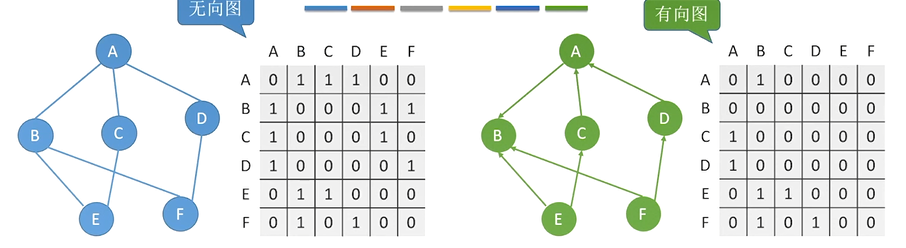

## 7.2 图的存储

### 7.2.1 邻接矩阵法



**邻接矩阵存储：**用一个一维数组存储图中顶点的信息，用一个二维数组存储图中边的信息(即各顶点之间的邻接关系)。

**邻接矩阵：**存储顶点之间邻接关系的二维数组称为邻接矩阵。

**代码实现：**

```C++
#define MaxVertexNum 100//顶点数目的最大值
typedef char VertexType//顶点的数据类型
typedef int EdgeType//边的权值的数据类型
typedef struct{
    VertexType Vex[MaxVertexNum];//顶点表
    EdgeType Edge[MaxVertexNum][MaxVertexNum];//邻接矩阵、边表
    int vexnum,arcnum;//图当前的顶点数和边数/弧叔
}MGraph;
```

$$
A[i][j]=
\begin{cases}
	1,& <v_i,v_j>是E(G)中的边\\ 0,&<v_i,v_j>不是E(G)中的边
\end{cases}
$$

**求顶点的度：**检查顶点相关的行或列，求非零元素的个数

**无向图：**

-   第i个结点的度=第i行(或第i列)的非零元素的个数（时间复杂度$O(n)$或$O(|V|)$）

**有向图：**

-   第i个结点的出度=第i行的非零元素的个数
-   第i个结点的入度=第i列的非零元素的个数
-   第i个结点的度=第i行、第i列的非零元素的个数之和

**对带权图：**
$$
A[i][j]=
\begin{cases}
	w_{ij},&<v_i,v_j>是E(G)中的边\\ 0或\infty ,&<v_i,v_j>不是E(G)中的边
\end{cases}
$$
**邻接矩阵法性能分析：**

-   空间复杂度$O(n^2)$——只和顶点数相关，和实际边数无关。
-   适合存储稠密图
-   无向图的邻接矩阵是对称矩阵，可以压缩存储(只存储上三角区/下三角区)

**邻接矩阵法的性质：**


7.2.2 邻接表

7.2.3 十字链表

7.2.4 邻接多重表